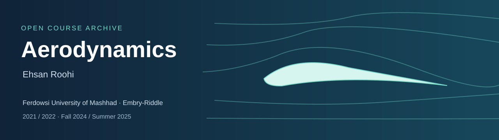

# Aerodynamics

**Ehsan Roohi · Ferdowsi University of Mashhad & Embry-Riddle Aeronautical University**

Original teaching materials organized by institution, offering and topic. FUM materials follow **Foundations of Aerodynamics and Propulsion**; ERAU materials belong to **AE 319 Aerodynamics**. These are historical course archives.

این آرشیو، منابع درس آیرودینامیک دکتر احسان روحی در دانشگاه فردوسی مشهد و امبری‌رِدل را با تفکیک ترم، ترتیب جلسات و موضوع ارائه می‌کند. جزوه‌ها و تکلیف‌های اصلی حفظ شده‌اند؛ نوار اسامی، گفت‌وگو و تصاویر دانشجویان از ضبط‌های فردوسی حذف شده است.

| Start here | Contents |
| --- | --- |
| [Syllabus and course guide](SYLLABUS.md) | Original syllabi and curriculum differences |
| [Ordered lectures](LECTURES.md) | 59 lecture files, including 17 dated Summer 2025 PDFs |
| [Video library](VIDEOS.md) | 34 original recordings · 30.2 hours |
| [Assignments](ASSIGNMENTS.md) | 30 homework PDFs, editable sources and practice questions |
| [Supporting materials](MATERIALS.md) | Worked classroom examples, derivations, formula sheets and reviews |
| [Course browser](index.html) | Download the HTML file and open it for search, semester filters and playback |
| [Provenance](PROVENANCE.md) | Original file attribution, archive gaps and video processing |

**Video publication in progress:** 34 of 38 source recordings are available. Remaining recordings are being prepared and verified.

## Choose your offering

| Institution | Offering | Archive |
| --- | --- | --- |
| Ferdowsi University of Mashhad | Fall 2021 · Persian | [Open offering](offerings/fum-2021.md) |
| Ferdowsi University of Mashhad | Fall 2022 · Persian | [Open offering](offerings/fum-2022.md) |
| Embry-Riddle Aeronautical University | Fall 2024 · English | [Open offering](offerings/erau-2024.md) |
| Embry-Riddle Aeronautical University | Summer 2025 · English | [Open offering](offerings/erau-2025.md) |

## Learning sequence

1. **[Fundamentals & conservation](modules/01.md)** — Forces, coefficients, kinematics, continuity, momentum and energy.
2. **[Potential flows & circulation](modules/02.md)** — Velocity potential, stream function, elementary flows and lifting cylinders.
3. **[Viscous flows & boundary layers](modules/03.md)** — Reynolds number, separation, skin friction and wake drag.
4. **[Airfoils & thin-airfoil theory](modules/04.md)** — Geometry, vortex sheets, Kutta condition, lift and moments.
5. **[Finite wings](modules/05.md)** — Downwash, lifting-line theory, lift distribution and induced drag.
6. **[Compressibility & thermodynamics](modules/06.md)** — Mach number, stagnation quantities, energy and entropy; FUM extensions include heating and friction.
7. **[Shocks & expansion waves](modules/07.md)** — Normal and oblique shocks, flow deflection and expansion fans.
8. **[Nozzles & choking](modules/08.md)** — Quasi-one-dimensional flow and converging-diverging nozzle regimes.
9. **[Subsonic & transonic flow](modules/09.md)** — Compressibility corrections, critical Mach number and drag divergence.
10. **[Supersonic airfoils](modules/10.md)** — Shock-expansion methods and linearized supersonic theory.
11. **[Hypersonic flow](modules/11.md)** — High-Mach-number approximations and worked aerodynamic examples.
12. **[Propulsion companion · FUM](modules/12.md)** — Air-breathing engines and cycle analysis from the combined FUM curriculum.

The topic sequence is a study guide, not a replacement for an original semester schedule. FUM recording-session numbers and slide-deck numbers are independent.

## Using the archive

Read the syllabus for your offering, follow its lecture sequence, watch the companion recordings and work through that semester’s homework. Download scans for zoom and handwritten detail. PowerPoint and available Word sources remain editable. The browser uses GitHub links by default; enable local files for a cloned copy. Long recordings use numbered parts in playback order, retaining their full duration.

No separate Summer 2025 syllabus was found; Fall 2024 policies are not assigned to Summer. No syllabus was found inside the Fall 2022 folder. The revision named “1401” is included with its original source location explained. Fall 2024 lists Homework 11 in the schedule, but only HW1–HW10 were found.

## Related courses

[Space Propulsion — AE 414](../space-propulsion/README.md) · [Aerospace Structures](https://github.com/Ehsan-Roohi/Aerospace-Structures) · [FlowMLLab](https://github.com/Ehsan-Roohi/FlowMLLab)

## Attribution

Original institutional headings, course-handout credits, EPG footers and figure references are preserved. Some FUM covers retain an earlier Sharif affiliation. The archive does not imply sole authorship of every underlying figure or slide, and no universal license is applied to third-party components. See [provenance](PROVENANCE.md) and [citation metadata](CITATION.cff).
