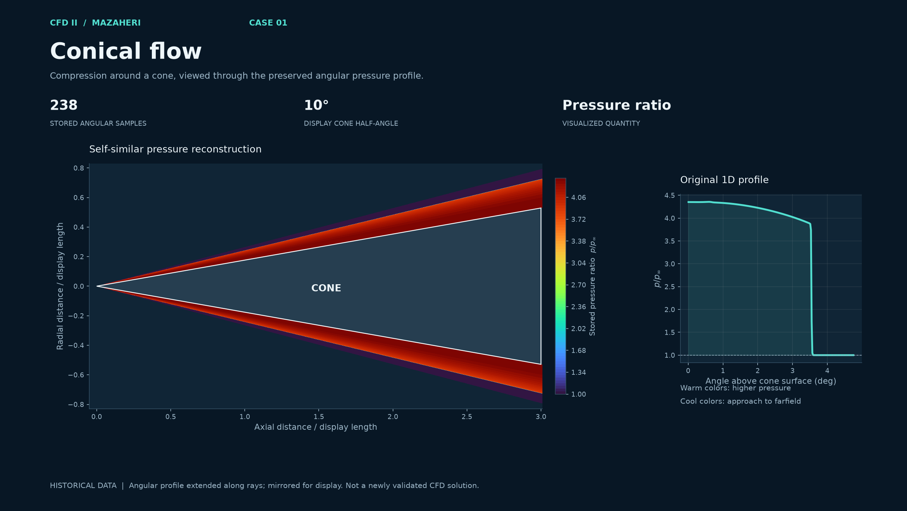
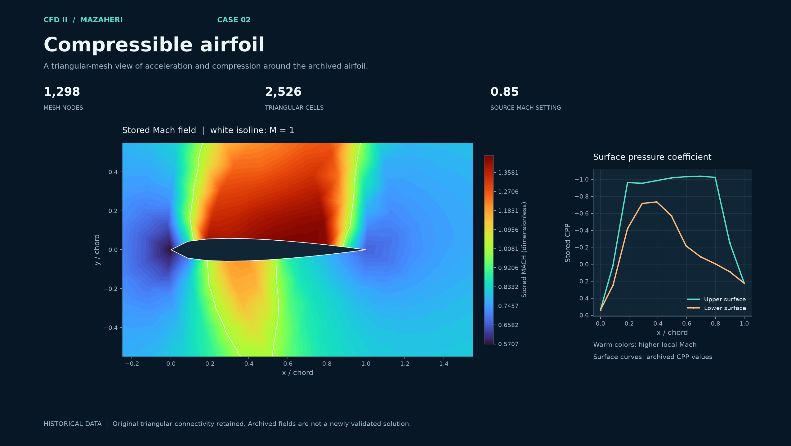
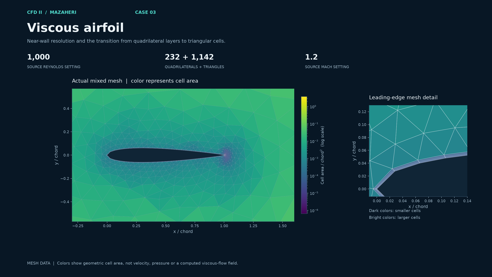

# Computational Fluid Dynamics II - Mazaheri

Historical CFD II coursework from Ehsan Roohi's course with Dr. Mazaheri, including Fortran sources, mesh inputs, project reports and supplementary lectures. A local Project 1 cover names Dr. Mazaheri and Spring 1386 in the Persian calendar. Repository documentation is in English; original reports and scanned lecture documents retain their source language and attribution.

## Explore the three visual case pages

| [01 · Conical flow](case-studies/conical-flow/README.md) | [02 · Compressible airfoil](case-studies/compressible-airfoil/README.md) | [03 · Viscous airfoil](case-studies/viscous-airfoil/README.md) |
| --- | --- | --- |
| [](case-studies/conical-flow/README.md) | [](case-studies/compressible-airfoil/README.md) | [](case-studies/viscous-airfoil/README.md) |
| Historical pressure profile and conical reconstruction | Historical Mach field and surface pressure curves | Actual mixed mesh colored by cell area |

Each page explains the physical problem, the numerical method and the figure, with direct links to code and reports. [Full-size visual gallery](case-studies/README.md).

## How many projects are there?

The available archive contains **three numbered course projects**, plus a supporting grid-generation component. Four code directories organize these materials; the grid directory does not establish a fourth independent course assignment. The archive contains **23 Fortran files**, including alternative versions, copies configured for different meshes, and a postprocessor. They are not 23 separate projects.

| Course project | What the code calculates | Archived sources | Supporting material |
| --- | --- | ---: | --- |
| [1. Conical flow](projects/01-conical-flow/README.md) | Compressible flow in conical coordinates: radial/tangential velocity, pressure, density, temperature and energy; Roe, Van Leer and H-L-R flux branches and boundary switches. | 6, including a postprocessor | [Project document](reports/01-conical-flow/Project.doc) |
| [2. Compressible airfoil](projects/02-compressible-airfoil/README.md) | Density, two momentum components and energy on unstructured triangular meshes; Roe-type face fluxes and multistage updates. | 13, including case-specific copies | [Project brief](reports/02-compressible-airfoil/Project%20II.doc), [report](reports/02-compressible-airfoil/Report%202.doc), [Mach 2 appendix](reports/02-compressible-airfoil/Appendix%20M%3D2%20Results.doc) |
| [3. Viscous airfoil](projects/03-viscous-airfoil/README.md) | Compressible flow with inviscid and viscous fluxes on mixed triangular/quadrilateral connectivity, Reynolds-number settings and wall treatment. | 2 | [Report](reports/03-viscous-airfoil/Report%203.doc) |
| [Supporting grid generation](projects/04-grid-generation/README.md) | NACA 0012 boundary geometry, an outer circular boundary, interpolation and elliptic smoothing; one variant also attempts orthogonality control. | 2 | [Historical grid outputs](results/04-grid-generation) |

Counts describe the selected archive, not every duplicate or executable in the original folders. [Provenance](docs/provenance.md) records the selection and authorship limitations.

## Execution and correctness

**Current result: not fully numerically validated.** All 23 Fortran files compile with documented working-copy adaptations; both grid generators run, while the course flow attempts expose runtime defects. SIMPLE passes a uniform-flow test and produces finite airfoil diagnostics.

Read the [execution and validation report](docs/validation/README.md) before using numerical outputs. It separates compilation, runtime checks, exact-solution tests and physical validation. Failures and compatibility changes are documented. Original Fortran files remain byte-for-byte archival copies; experiments use separate working directories.

The external [jyoun35/SIMPLE](https://github.com/jyoun35/SIMPLE) repository is an additional Python example for **incompressible** pressure-velocity coupling. It is distinct from the compressible course projects. The [English SIMPLE review](docs/SIMPLE-review.md) explains its algorithm, limitations, specific defects and executed diagnostics. Upstream source is downloaded only into a local validation checkout and is not republished here.

## Lectures and study sequence

[Lecture index](lectures/README.md): **23 educational PDFs** comprising eight Hejranfar chapter/scanned-note files, three Bakker/Van Leer supplementary files, and eleven RWTH Aachen lecture PDFs with one syllabus. The instructors are identified separately. Mazaheri's own independent lecture files have not been identified in the searched folders.

1. Read Hejranfar chapters 1-3 for governing equations, Euler structure and boundary conditions; then examine Project 1.
2. Read chapters 4-5 for grid generation and finite-volume fluxes; then study the grid component and Project 2.
3. Study Project 3's viscous terms, wall treatment and mixed mesh, keeping its configuration and inputs together.
4. Read chapter 6 for incompressible pressure-velocity coupling; then use the SIMPLE review and uniform-flow benchmark.
5. Use Bakker/Van Leer for compressible-flow context and Aachen for additional modern numerical/software methods.

## Reproduce the checks

```text
python tools/verify_archive.py
python tools/validate_fortran.py --compiler /path/to/gfortran --work work/validation-new
python tools/validate_simple.py --source-root /path/to/pinned/SIMPLE --mesh data/meshes/rectangle.msh --case uniform --iterations 20 --output work/simple-uniform
```

The validation report gives dependencies, compiler options and the exact scope of recorded runs. A fresh working directory is required for each Fortran attempt. Several original programs contain Windows deletion commands; the helper removes those commands only from working copies.

## Archive contents

- [Detailed project guides](projects/README.md): 23 Fortran files and 30 mesh input files.
- [Reports](reports/README.md): five original Word documents.
- [Historical results](results/README.md): five original outputs, distinguished from new validation evidence.
- [Lecture notes](lectures/README.md): 23 attributed educational PDFs.
- [Manifest](manifest.json): byte counts, SHA-256 hashes and original paths for 86 preserved originals.

Original documents retain their authors' reuse terms; no blanket license is assigned to third-party material.
