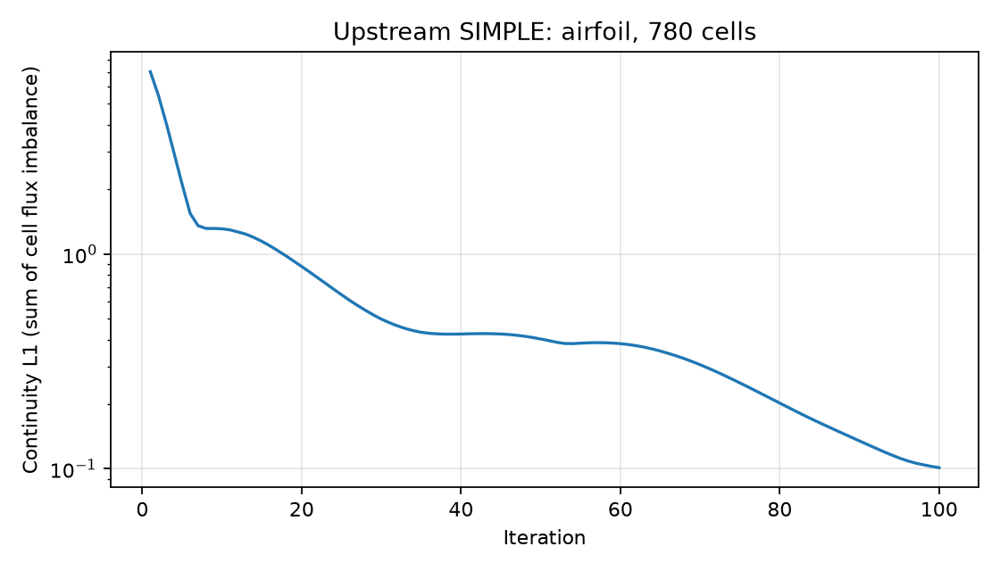
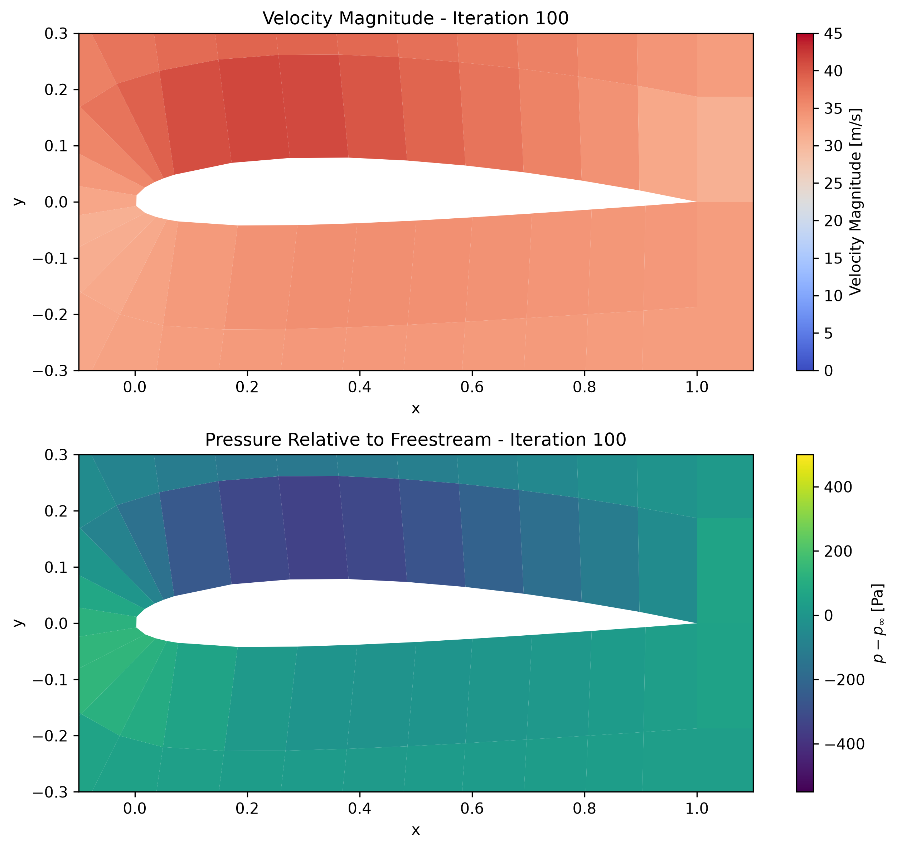
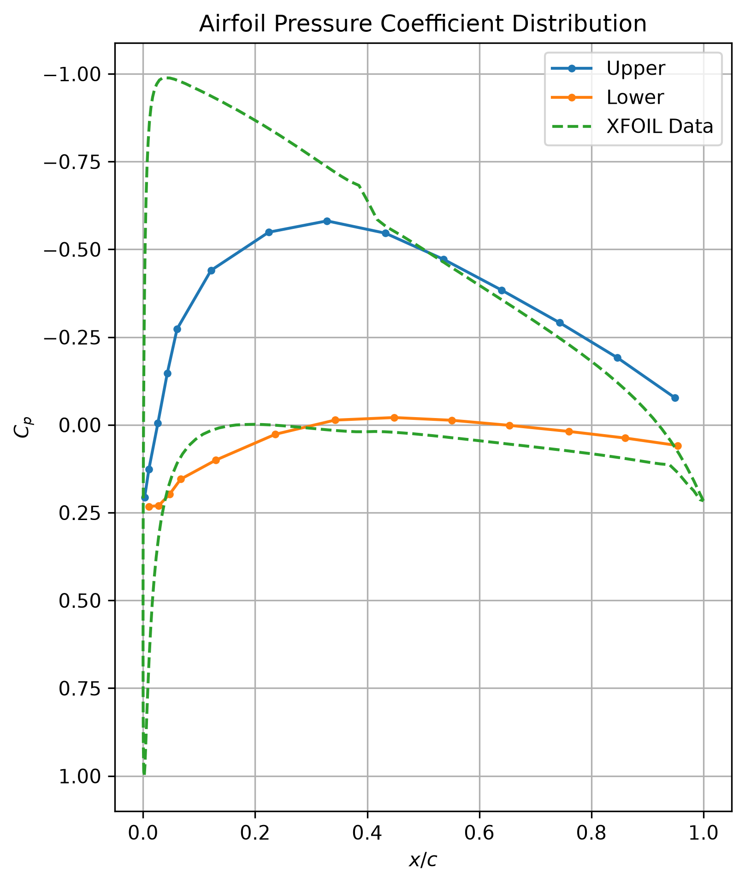

# Execution and validation report

Date: **October 6, 2026**. Scope: the 23 archived Fortran files, six co-located airfoil mesh cases, and the external Python SIMPLE solver at a pinned revision.

**The archive is not fully numerically validated.** The two grid generators run successfully, and SIMPLE passes an exact uniform-flow check. The course flow solvers have reproducible runtime defects, and the SIMPLE airfoil diagnostic is not a certified aerodynamic solution.

## What was actually executed

| Check | Scope | Outcome |
| --- | --- | --- |
| Archive integrity | 85 preserved original files, plus local documentation links | Original-file hashes checked; originals were not rewritten |
| Mesh consistency | Five Project 2 cases and the main Project 3 mixed mesh | All six pass basic connectivity, signed-area and source-dimension checks |
| Fortran compilation | All 23 archived files | All 23 build on Linux; 10 need only cleanup removal, 13 also need recorded compatibility adaptations |
| Fortran runtime | 15 programs with enough configuration to attempt execution | 2 grid generators complete; 12 flow-source attempts fail diagnostic checks; 1 quantity variant fails because matching mesh inputs are absent |
| Other Fortran files | Seven root numerical/airfoil variants and one contour postprocessor | Built; not run because matching inputs or prior flow outputs are missing |
| SIMPLE exact uniform flow | 931 rectangular cells, 20 iterations | Exact state preserved; maximum velocity errors below 1.5e-10 |
| SIMPLE NACA 2412 | 780 cells, 100 iterations, 34.3 m/s, 3-degree incidence | Finite fields; continuity L1 decreases from 7.06525 to 0.101240; physical accuracy not established |
| SIMPLE skew-pressure interpolation | Actual pinned Rhie-Chow function | Fails affine-pressure consistency: erroneous face velocity -0.5857864376 instead of zero |

The Fortran results come from this [Linux GitHub Actions run](https://github.com/Ehsan-Roohi/Ehsan-Roohi/actions/runs/37463746306), using GNU Fortran 13.3.0 on Ubuntu 24.04. Windows compilation was also attempted, but Windows refused to launch newly built executables, including a minimal test program. Linux execution resolved that environment limitation.

The workflow's successful status means the **evidence collection completed**, not that every numerical check passed. Per-source results and failure logs are in [fortran-validation.json](fortran-validation.json). Repetitive grid stdout is shortened there; the linked CI job retains the complete logged evidence.

## Working-copy changes and diagnostics

The original sources in `projects/` are preserved byte for byte. The validation tool copies inputs and writes a separate `source.for` or `source.f90` for each attempt.

- It removes active Windows `CALL SYSTEM("del ...")` commands.
- When needed, it removes unused `MSIMSL`/`MSFLIB` imports and places `IMPLICIT` before `PARAMETER`.
- For the two viscous sources, it declares a local integer `I` inside `VISCOUS`, which otherwise assigns an active host loop index.
- On Linux it creates case-matching aliases for co-located input filenames. It does not substitute an unrelated mesh.

Each change is listed in the JSON evidence. These adaptations make builds possible; they do not repair the numerical defects described below.

The build enables `-fcheck=all`, `-ffpe-trap=invalid,zero,overflow`, `-finit-real=snan`, `-finit-integer=-999999` and backtraces. Uninitialized values therefore become visible instead of inheriting arbitrary memory contents. A failing diagnostic identifies unsafe arithmetic/index use; the effect on a particular conventional build requires tracing that statement. We do not infer that every floating-point trap necessarily reflects a corrupted interior solution.

## Course-code findings

| Project/source | Executed outcome | Evidence or implicated operation |
| --- | --- | --- |
| Project 1: `all-codes/Second0.for` | EOF during method selection | Unit 5 is reopened as `Output.plt` before `read*`, so the prompt no longer reads standard input |
| Project 1: `all-codes/uniform.for` | Floating-point trap in initialization | Invalid/uninitialized state reaches the initialization expressions |
| Project 1: `VAN LEER.for`, HLR `Second.for` and `Second0.for` | Floating-point traps in `VISCUS` | Includes `DUTDT2(1)` in an expression inside a cell loop; initialization/index behavior needs review |
| Project 2: 85-medium and 85-high | Floating-point traps in initialization | The recorded working-copy failure reaches Mach/sound-speed calculations |
| Project 2: exact and very-high | Bounds errors in `FLUX` | An uninitialized face index `L=-999999` is used as the second index of `DX` |
| Project 2: two uniform-case sources | Floating-point traps in initialization or flux evaluation | Exact locations are retained in the run logs |
| Project 3: main viscous case | Bounds error in `CELLNODE` after compilation adaptation | An uninitialized `NODE_VICINITY` entry is used as an index into `RHOO` |
| Project 3: quantity variant | EOF in mesh input | Matching node/connectivity inputs are not co-located with this source |
| Supporting grid generators | Both complete with exit code 0 | 51-by-51 and 25-by-25 point generators; the latter used relaxation input 1.0 |

The main viscous source also computes quadrilateral `Y_CELL` with `XNODE(N4)` instead of `YNODE(N4)`. Evaluation on the preserved input mesh affects **all 232 quadrilateral cells**, with maximum absolute y-coordinate error **0.2523715323 in mesh coordinate units**. This is a geometry defect even though the mesh file itself is valid. See [mesh-validation.json](mesh-validation.json).

Successful grid-program execution has not been followed by a full generated-grid quality study. Positive Jacobians, cell orientation, stretching, orthogonality and boundary accuracy remain acceptance checks before those newly generated grids are used in a flow solution. Historical plots in `results/` remain labeled as historical, not newly validated output.

## SIMPLE: exact-solution test

The uniform test uses the upstream rectangular mesh, inlet `u=1`, `v=0`, outlet `p=101325`, slip side walls and the same iteration operators and relaxation schedule as upstream. Uniform velocity and pressure form an exact solution of this configured problem.

| Metric after 20 iterations | Value |
| --- | ---: |
| Maximum absolute error in u | 1.42578e-10 |
| Maximum absolute error in v | 1.43915e-10 |
| Maximum absolute pressure error | 0 |
| Continuity L1 | 4.07464e-9 |
| Cell count | 931 |
| Finite fields / positive cell areas | Yes / yes |

This confirms preservation of one simple solution on the tested rectangular mesh. It does not test nonuniform pressure, skew-grid accuracy, viscous wall behavior or momentum convergence.

[JSON](simple-uniform.json) · [residual CSV](simple-uniform.csv) · [saved fields](simple-uniform.npz)

## SIMPLE: airfoil diagnostic

The upstream very-coarse NACA 2412 mesh has 780 quadrilateral cells and 918 nodes. This diagnostic calls the original numerical functions at commit `6a1d90684c9462aa48416894f147910ca20e238f`; it changes the mesh and iteration count from the default main program, while retaining its physical settings and relaxation schedule. It does not perform the default fine-mesh 1000-iteration calculation.

| Metric | First iteration | Iteration 100 |
| --- | ---: | ---: |
| Continuity L1, sum of absolute cell flux imbalance | 7.06525 | 0.101240 |
| Maximum cell continuity imbalance | 0.665818 | 0.00146062 |
| Signed net continuity imbalance | -0.0256899 | 0.000117148 |
| Maximum speed, m/s | 37.2685 | 41.4628 |
| Maximum velocity update, m/s | 3.47994 | 0.0125048 |

All recorded velocity, pressure and residual values are finite. Final pressure spans approximately 100983.20-101461.80 Pa. There were no recorded warnings, and the actual upstream checkpoint/plot functions completed.

Residual reduction is evidence of progress, not proof of the final solution's accuracy. The update is still nonzero; no independently accepted convergence tolerance, momentum-residual assessment, mesh-refinement study or quantitative reference agreement was established. The pressure-coefficient plot differs visibly from the supplied XFOIL curve, particularly in the upper-surface suction peak. The slip-wall physics and reference-case assumptions must be reconciled before interpreting that plot as validation.







These figures are diagnostic outputs of the reviewed implementation. The original checkpoint helper retains its reversed pressure-color-limit defect. See the [English SIMPLE review](../SIMPLE-review.md) for that issue, the failed skew-pressure interpolation test, stale boundary-gradient indexing and repeated-corrector accumulation.

[Airfoil JSON](simple-airfoil-very-coarse.json) · [residual CSV](simple-airfoil-very-coarse.csv) · [saved fields](simple-airfoil-very-coarse.npz) · [isolated source-function diagnostics](../simple-diagnostics.json)

## Reproduction

The local SIMPLE runs used Python 3.12.14, NumPy 2.5.3, SciPy 1.18.1, Gmsh 4.15.2 and Matplotlib 3.11.2. Use an isolated Python environment and the [pinned dependency list](requirements.txt).

```text
python tools/verify_archive.py
python tools/validate_meshes.py --output work/mesh-checks.json
python tools/validate_fortran.py --compiler /usr/bin/gfortran --work work/new-fortran-attempt --output work/fortran-checks.json --timeout 30

python -m pip install -r docs/validation/requirements.txt
python tools/validate_simple.py --source-root /path/to/pinned/SIMPLE --mesh data/meshes/rectangle.msh --case uniform --iterations 20 --budget-seconds 120 --output work/simple-uniform
python tools/validate_simple.py --source-root /path/to/pinned/SIMPLE --mesh data/meshes/very_coarse_CMesh_NACA_2412.msh --case airfoil --iterations 100 --budget-seconds 600 --output work/simple-airfoil
```

Obtain the upstream SIMPLE checkout at the reviewed commit before running the last commands. The harness records source/mesh SHA-256 hashes, versions, case settings, completed iterations, field ranges, warnings and residuals. A time-budget stop is reported explicitly and is not labeled convergence.

Fortran logs reference the transformed `source.for` line numbers. Original source hashes and the adaptation list identify the corresponding archive file. Each Fortran work directory must be new.

## What is still needed for numerical acceptance

Repair and retest the identified indexing, initialization, input-stream and centroid defects. Then verify conservation and thermodynamic positivity in the compressible solutions, evaluate all equation residuals, compare matching physical cases to suitable analytical/experimental references, and assess mesh sensitivity. The [NASA/NPARC verification and validation tutorial](https://www.grc.nasa.gov/www/wind/valid/tutorial/tutorial.html) provides context; its [spatial-convergence discussion](https://www.grc.nasa.gov/www/wind/valid/tutorial/spatconv.html) explains why a mesh study adds evidence beyond residual reduction.

For an inviscid conical case, a Taylor-Maccoll comparison is appropriate only under matching assumptions; [NASA's 10-degree-cone example](https://www.grc.nasa.gov/www/wind/valid/cone10/cone10.html) illustrates that reference approach. Its Mach 2.35 case is not automatically the same as the archived Mach 7.95 configuration.

No Unity HPC job was submitted for these checks.
