# Project 1 — 2026 modernization: computed results

[Open the all-methods Google Colab notebook](https://colab.research.google.com/github/Ehsan-Roohi/Ehsan-Roohi/blob/main/courses/cfd-2/modern-python/conical/Conical_Flow_Modern_2026.ipynb) · [Source and equations](README.md) · [Download complete source, raw fields and PNG/PDF figures](../../downloads/conical-modern-2026.zip)

This report documents executed Python results for the historical conical-flow assignment. Original Fortran sources remain unchanged. The archive's project cover identifies Spring 1386 (2007); the author also describes the work as his 2006-era project. The modernization was executed in October 2026. New code, comments and report prose are in English.

## Complete-method notebook comparison

The revised Colab notebook opens with saved, genuinely computed figures and displays **68 recorded runs**: 44 primary flux/case comparisons, six FV reconstructions, twelve higher-order viscous/grid cases and six DG cases. Running all cells regenerates those figures from the recorded fields. Fresh computation is optional and selects all eleven fluxes by default. Curves can overlap; each flux also has a separate pressure panel and a table row.

The three earlier missing comparison fluxes—Van Leer, HLLE and Rusanov—were run with the same CWENO3 Euler and primitive-minmod viscous configurations. Both characteristic CWENO reconstructions were additionally run for HLLC at Mach 2.35. Every method is shown. The final primary viscous states use configuration-matched continuations where required; earlier failed attempts remain in the archive.

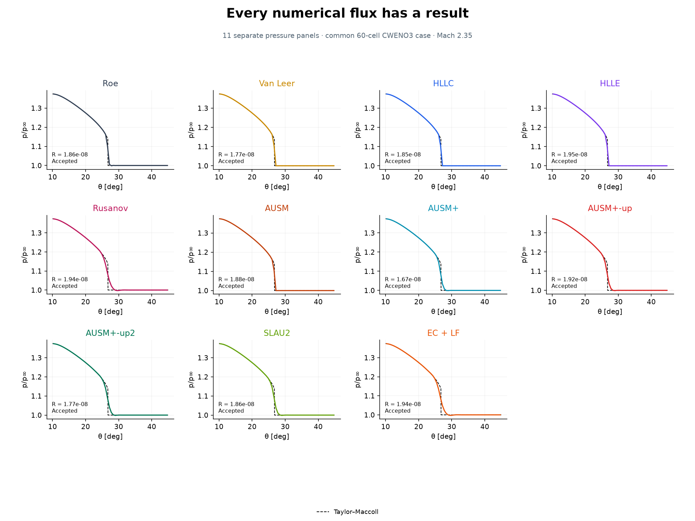

[Complete data catalog](results-notebook/catalog.json) · [Notebook execution coverage](colab-validation.json)

### Inviscid · Mach 2.35 · 11/11 accepted

| Flux | Status | Residual | p wall / p∞ |
|---|---|---:|---:|
| [Roe](results-v2/euler-m2.35-n60-roe-cweno3.json) | Accepted | 1.855e-08 | 1.3738719 |
| [Van Leer](results-notebook/m2.35/inviscid-vanleer-n60-cweno3.json) | Accepted | 1.771e-08 | 1.3739058 |
| [HLLC](results-v2/euler-m2.35-n60-hllc-cweno3.json) | Accepted | 1.847e-08 | 1.3738895 |
| [HLLE](results-notebook/m2.35/inviscid-hlle-n60-cweno3.json) | Accepted | 1.946e-08 | 1.3738887 |
| [Rusanov](results-notebook/m2.35/inviscid-rusanov-n60-cweno3.json) | Accepted | 1.938e-08 | 1.3736387 |
| [AUSM](results-v2/euler-m2.35-n60-ausm-cweno3.json) | Accepted | 1.879e-08 | 1.3739009 |
| [AUSM+](results-v2/euler-m2.35-n60-ausm-plus-cweno3.json) | Accepted | 1.673e-08 | 1.3736575 |
| [AUSM+-up](results-v2/euler-m2.35-n60-ausm-up-cweno3.json) | Accepted | 1.920e-08 | 1.3736235 |
| [AUSM+-up2](results-v2/euler-m2.35-n60-ausm-up2-cweno3.json) | Accepted | 1.774e-08 | 1.3737289 |
| [SLAU2](results-v2/euler-m2.35-n60-slau2-cweno3.json) | Accepted | 1.857e-08 | 1.3735317 |
| [EC+LF](results-v2/euler-m2.35-n60-ec-lf-cweno3.json) | Accepted | 1.938e-08 | 1.3736388 |

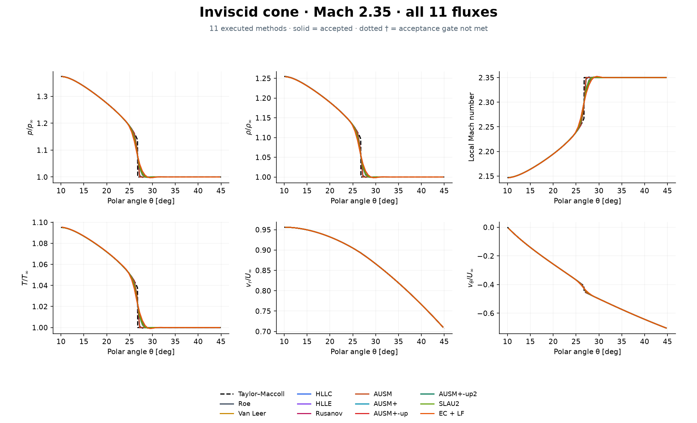

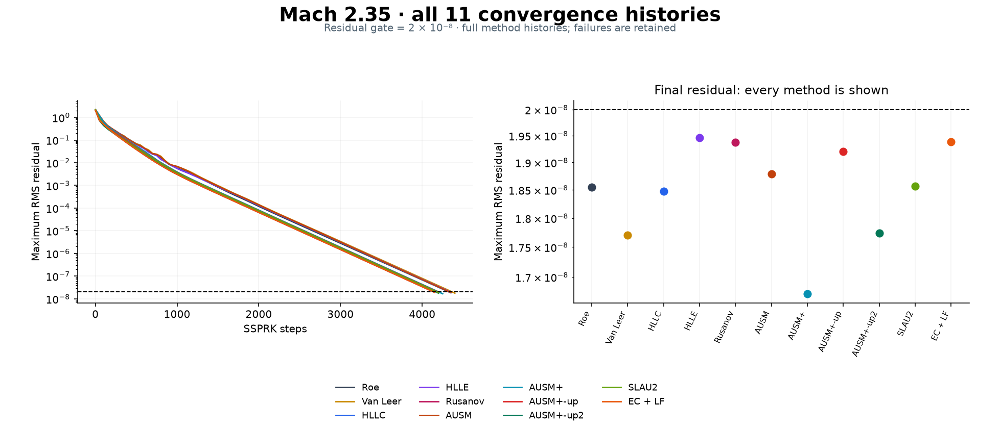

### Inviscid · Mach 7.95 · 5/11 accepted

| Flux | Status | Residual | p wall / p∞ |
|---|---|---:|---:|
| [Roe](results-v2/euler-m7.95-n60-roe-cweno3.json) | Accepted | 1.682e-08 | 4.0251306 |
| [Van Leer](results-notebook/m7.95/inviscid-vanleer-n60-cweno3.json) | Accepted | 1.770e-08 | 4.0244689 |
| [HLLC](results-v2/euler-m7.95-n60-hllc-cweno3.json) | Accepted | 1.696e-08 | 4.0152687 |
| [HLLE](results-notebook/m7.95/inviscid-hlle-n60-cweno3.json) | Accepted | 1.919e-08 | 4.0138925 |
| [Rusanov](results-notebook/m7.95/inviscid-rusanov-n60-cweno3.json) | Gate not met | 5.866e-01 | 3.9891349 |
| [AUSM](results-v2/euler-m7.95-n60-ausm-cweno3.json) | Accepted | 1.870e-08 | 4.0275752 |
| [AUSM+](results-v2/euler-m7.95-n60-ausm-plus-cweno3.json) | Gate not met | 4.079e-01 | 4.0078997 |
| [AUSM+-up](results-v2/euler-m7.95-n60-ausm-up-cweno3.json) | Gate not met | 2.299e-01 | 4.0029219 |
| [AUSM+-up2](results-v2/euler-m7.95-n60-ausm-up2-cweno3.json) | Gate not met | 1.149e+00 | 4.1213403 |
| [SLAU2](results-v2/euler-m7.95-n60-slau2-cweno3.json) | Gate not met | 6.363e-01 | 3.9582394 |
| [EC+LF](results-v2/euler-m7.95-n60-ec-lf-cweno3.json) | Gate not met | 7.255e-01 | 3.9835053 |

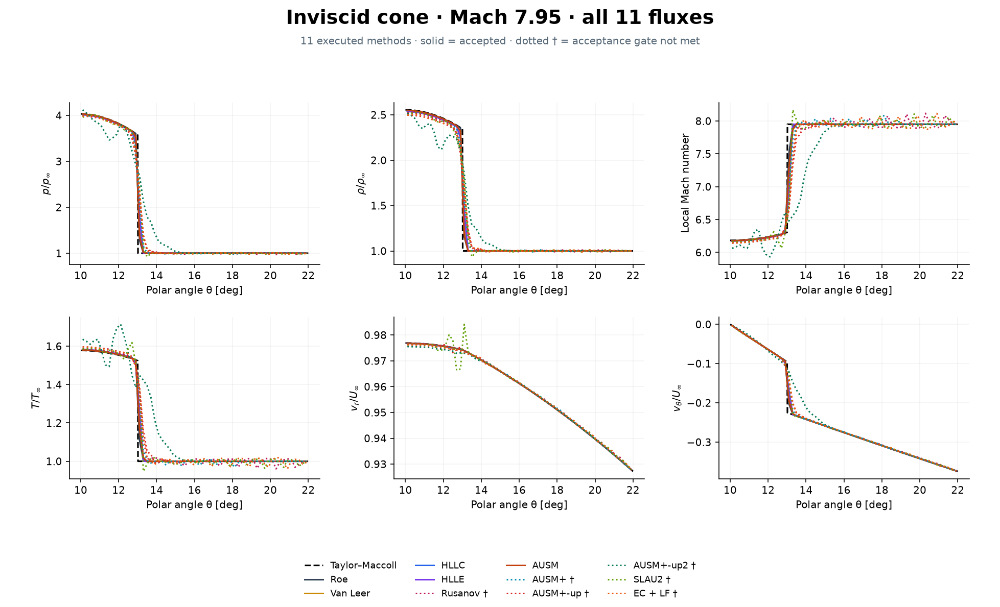

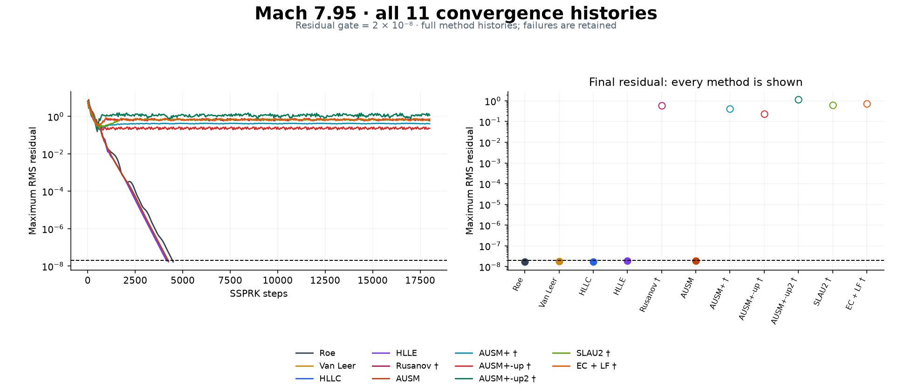

### Adiabatic · Mach 7.95 · 11/11 accepted

| Flux | Status | Residual | p wall / p∞ |
|---|---|---:|---:|
| [Roe](results-v2/fv2-steady-adiabatic-m7.95-n60-roe-primitive-minmod-g2.json) | Accepted | 1.385e-08 | 4.3353837 |
| [Van Leer](results-notebook/adiabatic/adiabatic-vanleer-n60-primitive-minmod.json) | Accepted | 1.870e-10 | 4.3462328 |
| [HLLC](results-v2/continued-fv2-steady-adiabatic-m7.95-n60-hllc-primitive-minmod-g2.json) | Accepted | 4.383e-09 | 4.3218807 |
| [HLLE](results-notebook/adiabatic/adiabatic-hlle-n60-primitive-minmod.json) | Accepted | 2.556e-10 | 4.3491459 |
| [Rusanov](results-notebook/adiabatic/adiabatic-rusanov-n60-primitive-minmod.json) | Accepted | 1.365e-08 | 4.3190811 |
| [AUSM](results-v2/fv2-steady-adiabatic-m7.95-n60-ausm-primitive-minmod-g2.json) | Accepted | 1.794e-08 | 4.3356708 |
| [AUSM+](results-v2/continued-fv2-steady-adiabatic-m7.95-n60-ausm-plus-primitive-minmod-g2.json) | Accepted | 9.244e-09 | 4.3054200 |
| [AUSM+-up](results-v2/fv2-steady-adiabatic-m7.95-n60-ausm-up-primitive-minmod-g2.json) | Accepted | 1.831e-08 | 4.3048082 |
| [AUSM+-up2](results-v2/fv2-steady-adiabatic-m7.95-n60-ausm-up2-primitive-minmod-g2.json) | Accepted | 6.253e-09 | 4.3075167 |
| [SLAU2](results-v2/fv2-steady-adiabatic-m7.95-n60-slau2-primitive-minmod-g2.json) | Accepted | 1.576e-08 | 4.3096384 |
| [EC+LF](results-v2/continued-fv2-steady-adiabatic-m7.95-n60-ec-lf-primitive-minmod-g2.json) | Accepted | 1.079e-08 | 4.3193527 |

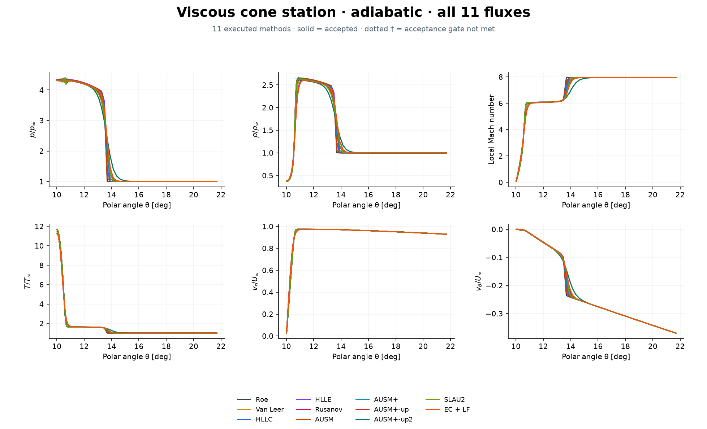

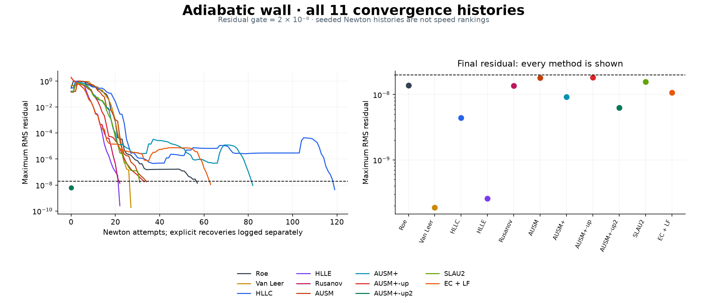

### Isothermal · Mach 7.95 · 11/11 accepted

| Flux | Status | Residual | p wall / p∞ |
|---|---|---:|---:|
| [Roe](results-v2/fv2-steady-isothermal-m7.95-n60-roe-primitive-minmod-g2.json) | Accepted | 1.076e-08 | 4.1249651 |
| [Van Leer](results-notebook/isothermal/isothermal-vanleer-n60-primitive-minmod.json) | Accepted | 1.602e-11 | 4.1351481 |
| [HLLC](results-v2/fv2-steady-isothermal-m7.95-n60-hllc-primitive-minmod-g2.json) | Accepted | 1.905e-08 | 4.1164823 |
| [HLLE](results-notebook/isothermal/isothermal-hlle-n60-primitive-minmod.json) | Accepted | 2.287e-10 | 4.1595695 |
| [Rusanov](results-notebook/isothermal/isothermal-rusanov-n60-primitive-minmod.json) | Accepted | 1.990e-08 | 4.1217361 |
| [AUSM](results-v2/fv2-steady-isothermal-m7.95-n60-ausm-primitive-minmod-g2.json) | Accepted | 1.526e-08 | 4.1305247 |
| [AUSM+](results-v2/fv2-steady-isothermal-m7.95-n60-ausm-plus-primitive-minmod-g2.json) | Accepted | 1.597e-08 | 4.1053175 |
| [AUSM+-up](results-v2/fv2-steady-isothermal-m7.95-n60-ausm-up-primitive-minmod-g2.json) | Accepted | 1.618e-08 | 4.1053805 |
| [AUSM+-up2](results-v2/fv2-steady-isothermal-m7.95-n60-ausm-up2-primitive-minmod-g2.json) | Accepted | 1.379e-08 | 4.1056293 |
| [SLAU2](results-v2/fv2-steady-isothermal-m7.95-n60-slau2-primitive-minmod-g2.json) | Accepted | 1.916e-08 | 4.1051882 |
| [EC+LF](results-v2/fv2-steady-isothermal-m7.95-n60-ec-lf-primitive-minmod-g2.json) | Accepted | 1.920e-08 | 4.1220533 |

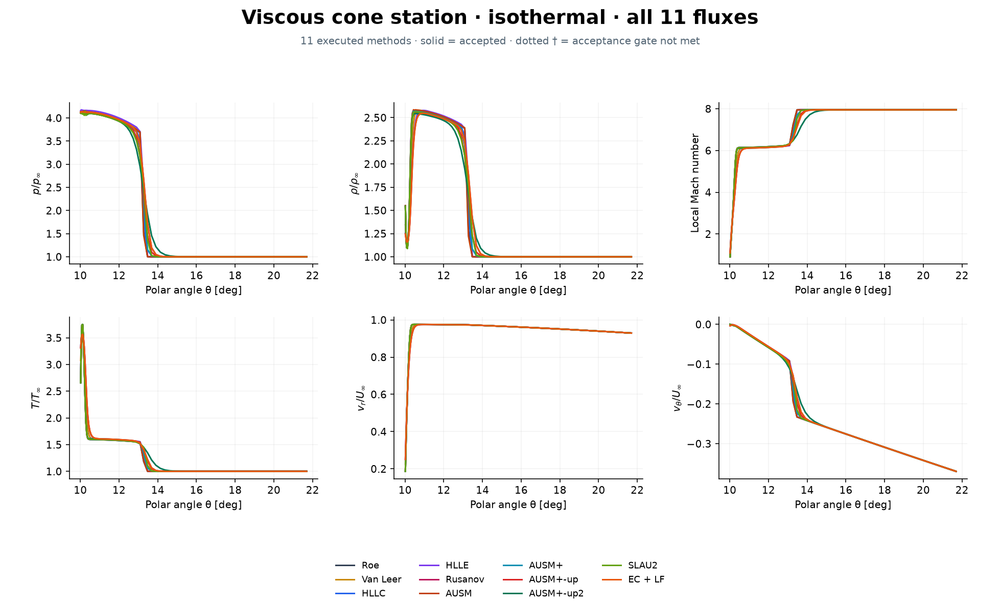

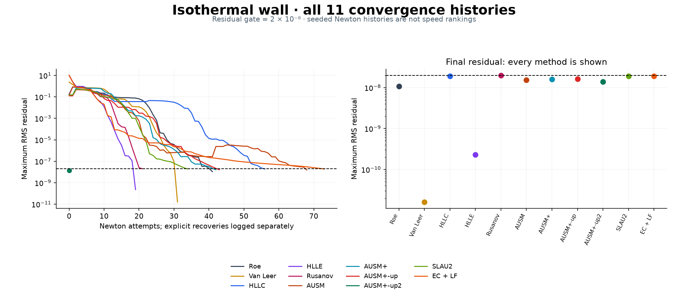

### Six reconstructions, higher-order viscosity and DG

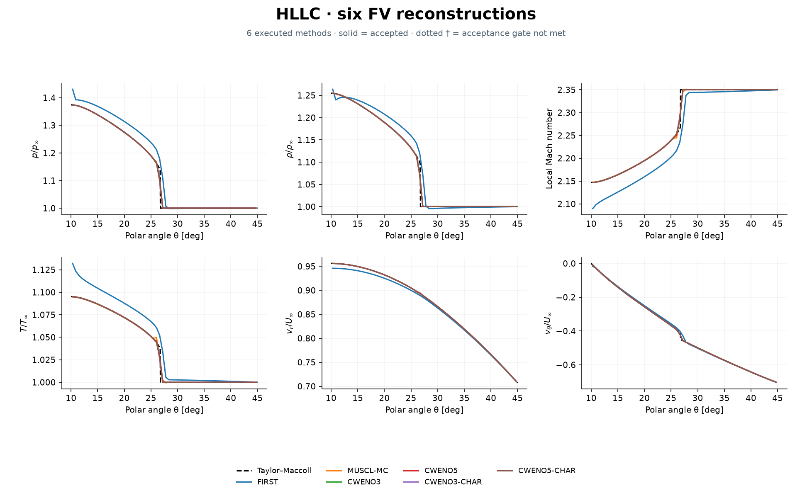

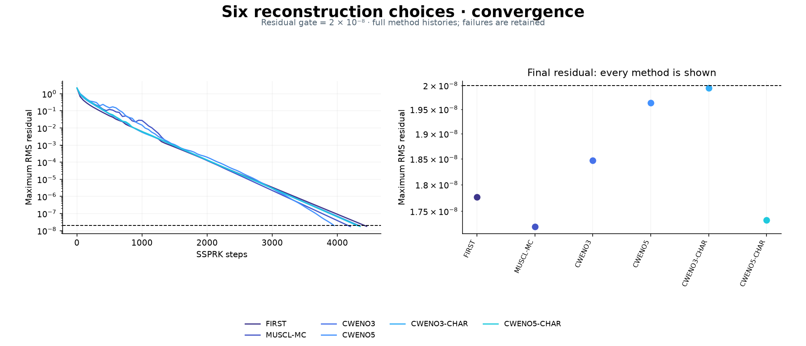

All six HLLC reconstruction runs at Mach 2.35/60 cells passed. The notebook also displays both thermal-wall higher-order/refinement comparisons and every DG degree/flux case, with their actual gate statuses. The earlier eight-flux study below is retained as its original experiment; its counts do not describe the new eleven-flux notebook study.

## What changed

The angular Euler model was migrated to modular Python/NumPy finite volumes, with corrected flux/source handling and independent Taylor–Maccoll validation. The extension adds AUSM, AUSM+, AUSM+-up, AUSM+-up2, SLAU2 and EC+LF alongside Roe, Van Leer, HLLC, HLLE and Rusanov. Reconstruction choices include constant, MUSCL-MC, CWENO3/5 and characteristic CWENO3/5.

The local-station viscous model adds Newtonian stresses, Sutherland or constant viscosity, heat conduction, no-slip walls and adiabatic/isothermal conditions. Nonuniform primitive-minmod/CWENO reconstruction, stretched meshes and interior viscous gradients of order 2/4 are available. Wall shear and heat flux are computed from the documented wall closure.

An [independent DG companion](DG.md) provides a second high-order discretization of the same inviscid angular equations. It is optional and its shock runs are reported separately. All methods are student-readable code; no packaged CFD solver is called.

## Acceptance, not just attractive curves

| Study | Accepted / attempted | Meaning |
|---|---:|---|
| Primary corrected-wall viscous comparison | 16 / 16 | Eight fluxes, both thermal walls, 60 cells |
| All corrected-wall viscous refinements/operators | 29 / 36 | Includes coarse, fine and higher-order attempts |
| Characteristic CWENO5 / fourth-order viscous interior operator | 9 / 12 | Smooth operator order does not guarantee shock/wall convergence |
| Component-wise CWENO3 Euler extension | 14 / 24 | Mach 2.35 and 7.95, controlled common-CFL study |
| Optional DG cone study | 2 / 6 | Both degree-zero runs accepted; degree 1/2 are exploratory |

The FV residual gate is the maximum RMS pseudo-time residual over all four conservation equations, below 2 × 10⁻⁸. Accepted Newton states also pass a 20-step explicit state-drift gate below 10⁻⁷. DG applies the residual gate to **all modal coefficients**, not just the means. A fine high-order viscous state that reached the residual tolerance but failed the explicit drift check was rejected. Its failure remains in the data.

All 11 fluxes are selectable in Colab. Controlled long-run figures compare the eight listed in the extension study; the earlier inviscid study includes Van Leer, HLLE and Rusanov. This does not claim that every possible flux/reconstruction/physics combination has passed a long steady run.

## Physical interpretation

The wall is stationary: both velocity components approach zero in the viscous runs. An adiabatic wall has zero imposed heat flux and develops an elevated temperature through viscous dissipation. The cold isothermal comparison fixes T_wall/T∞ = 1 and removes heat from the fluid. Positive wall heat flux is defined **into the fluid**, so the cold-wall result is negative.

| AUSM+-up2, 60-cell primary case | p_wall/p∞ | Skin friction C_f | T_wall/T∞ | Wall heat flux into fluid |
|---|---:|---:|---:|---:|
| Adiabatic | 4.307517 | 0.00385088 | 11.71514 | 0 |
| Isothermal | 4.105629 | 0.00407281 | 1 | −0.00108615 |

These are predictions of the documented angular local-station model, not measurements. Mach 7.95, cone 10°, outer angle 22°, gamma 1.4, Re = 420,000 and Pr = 0.72 are used in the primary viscous comparison. The cold-wall condition is a mathematical comparison case.

### Near-wall velocity and temperature

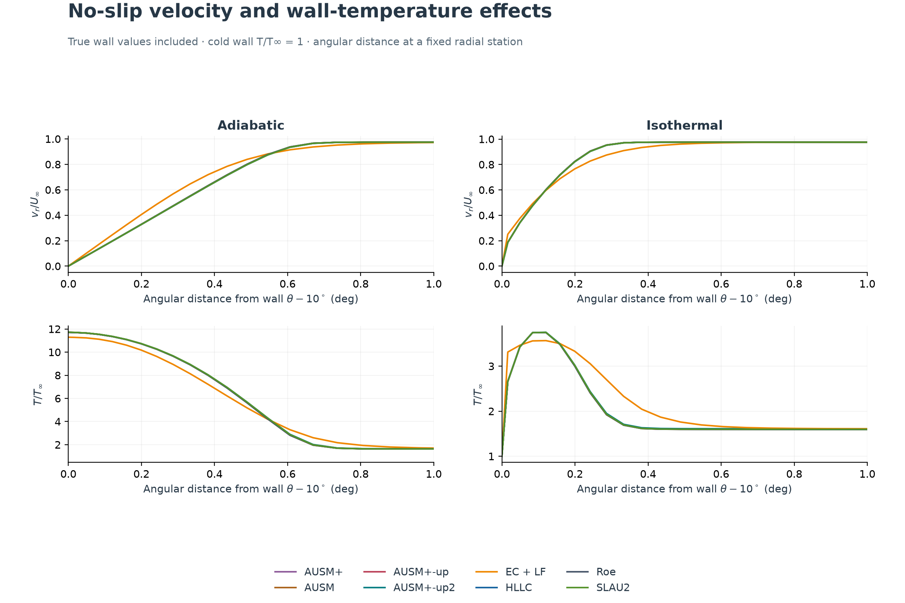

[Vector PDF](results-v2/near-wall-profiles.pdf). Methods that share nearly overlapping profiles agree on this coarse discretization; overlap alone does not establish mesh independence.

### Viscous convergence

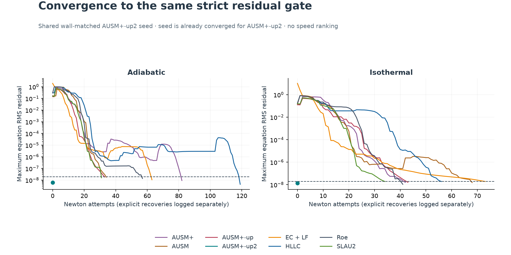

[Vector PDF](results-v2/steady-convergence.pdf). The methods use the same wall-matched coarse seed. AUSM+-up2 already generated that seed, so iteration counts and concurrent timings are **not fair speed rankings**. The abscissa records Newton attempts; explicit recovery steps are logged separately.

### Grid sensitivity, wall shear and heat transfer

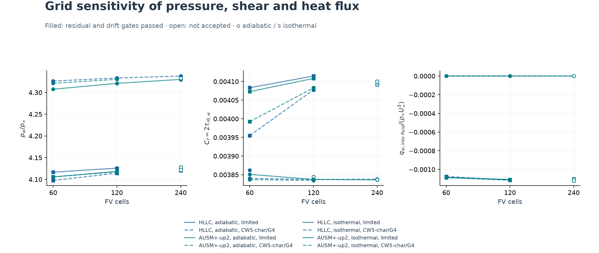

[Vector PDF](results-v2/grid-and-wall-transport.pdf). Filled markers are accepted states; hollow markers did not pass the gates. Unaccepted points are not connected as a validated refinement sequence. The study does not establish full mesh independence of all fine cold-wall cases.

### Full viscous properties

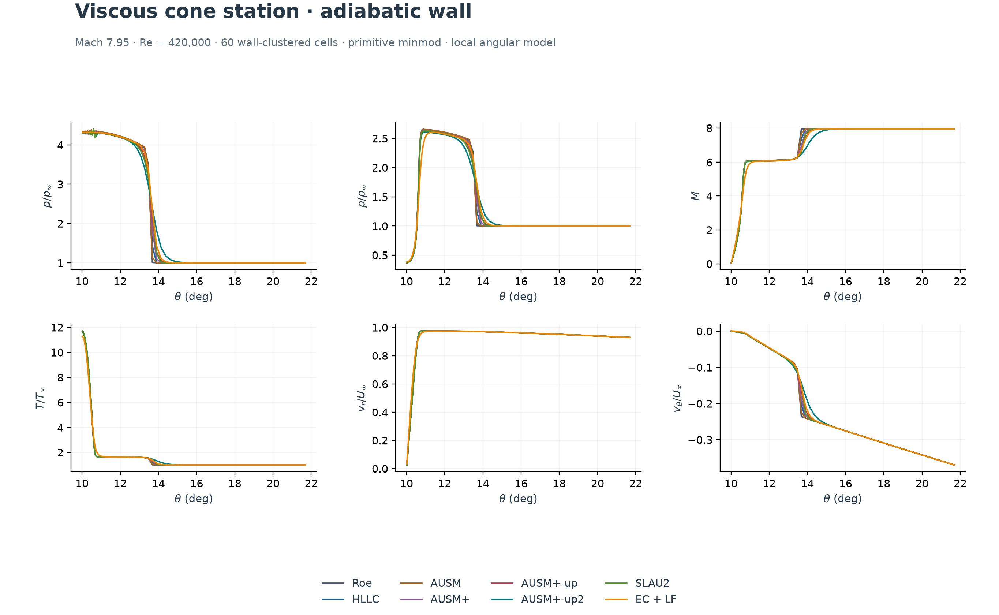

[Adiabatic vector PDF](results-v2/viscous-properties-adiabatic.pdf).

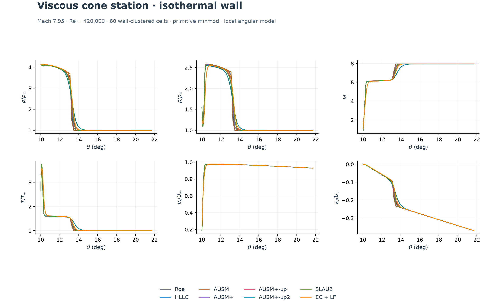

[Isothermal vector PDF](results-v2/viscous-properties-isothermal.pdf).

### Inviscid properties and convergence

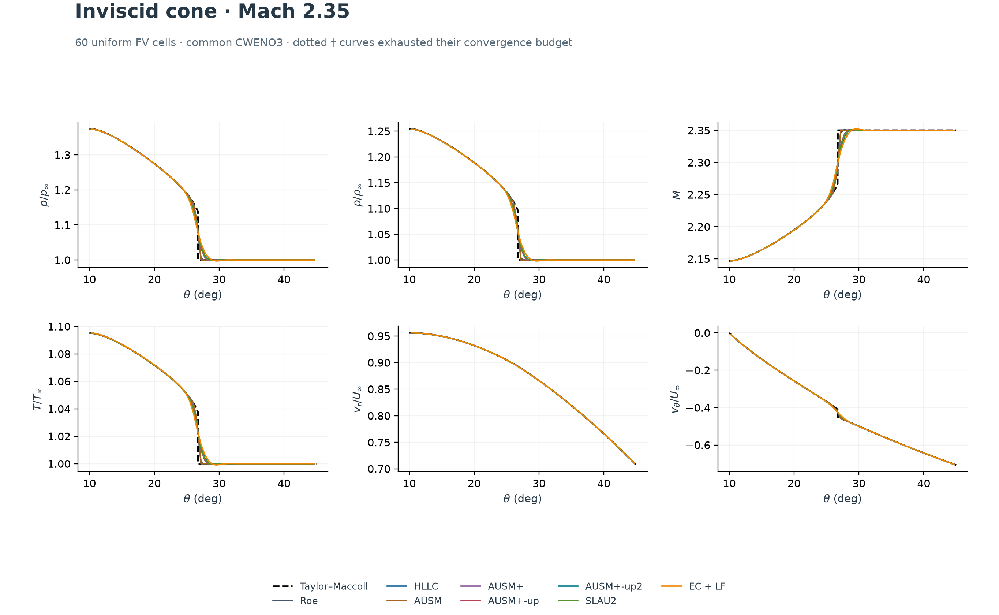

[Vector PDF](results-v2/euler-properties-m2.35.pdf).

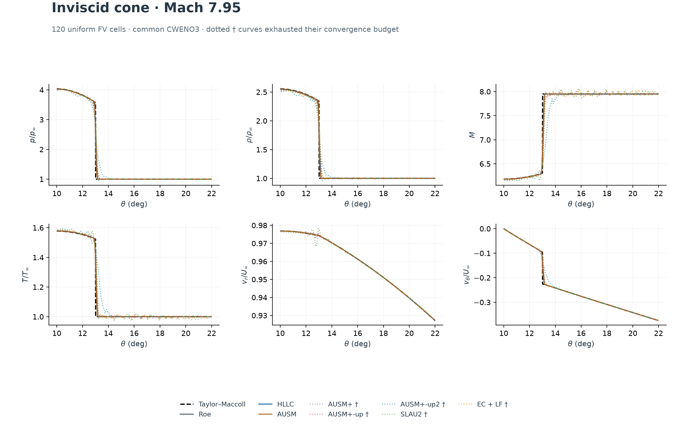

[Vector PDF](results-v2/euler-properties-m7.95.pdf). Dotted high-Mach curves are nonconverged attempts; their apparent agreement is not accepted accuracy evidence.

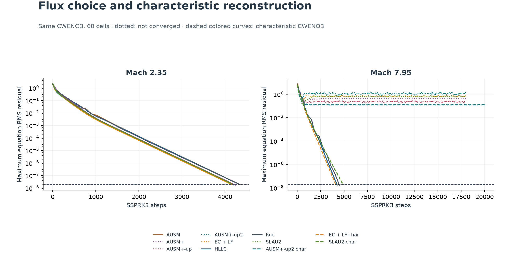

[Vector PDF](results-v2/euler-convergence.pdf). Additional characteristic reconstruction runs improve the recorded coarse-grid SLAU2 and EC+LF convergence; AUSM+-up2 still requires robustness work in that inviscid case.

## Independent verification

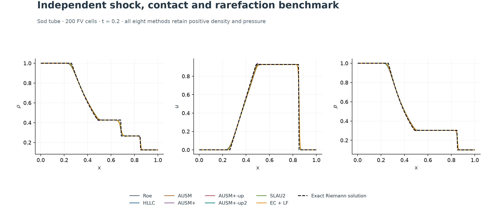

[Sod vector PDF](results-v2/sod-comparison.pdf). Shock, contact and rarefaction are compared against an exact planar Riemann solution, independently of the cone geometry.

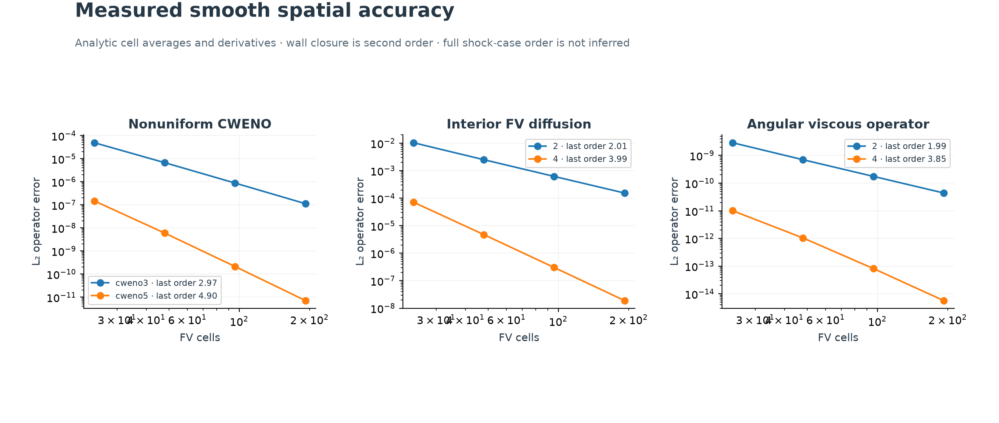

[Vector PDF](results-v2/spatial-verification.pdf). Analytic smooth tests check nonuniform CWENO, diffusion and the angular viscous operator. Constitutive checks include zero stress for uniform Cartesian velocity, trace-free deviatoric stress, Sutherland normalization and Re/Pr scaling. A Couette-heating problem checks viscous dissipation and wall heat transfer.

[Full FV verification JSON](results-v2/verification.json) · [Sod metrics](results-v2/sod-verification.json) · [Field integrity](results-v2/field-integrity.json) · [Earlier inviscid verification](results/verification.json)

## Optional DG results

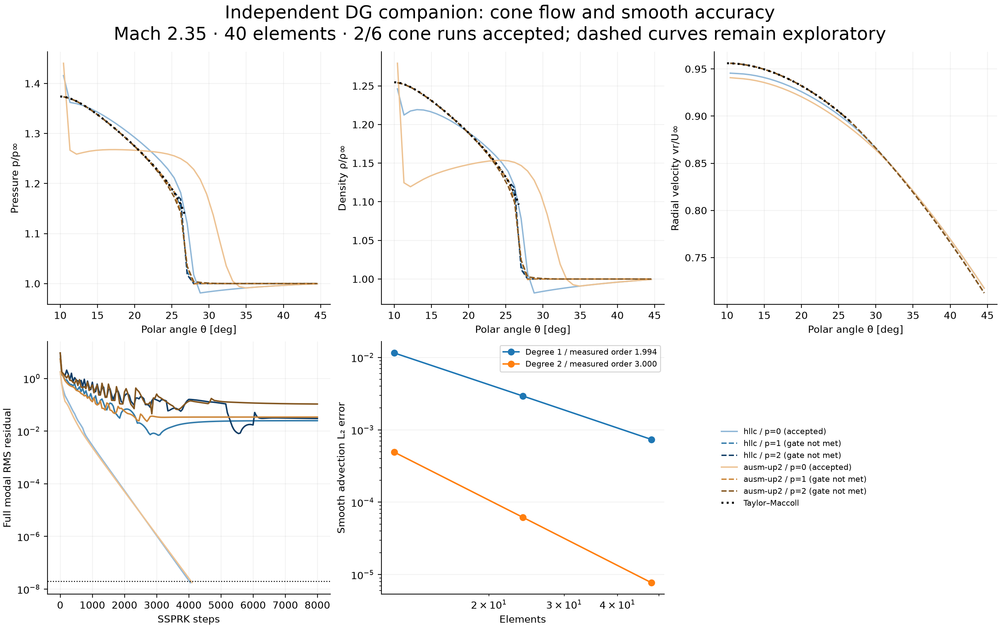

[Vector PDF](results-dg/comparison.pdf) · [DG verification](results-dg/verification.json) · [All six run records](results-dg/comparison.json) · [Method and limitations](DG.md).

Smooth measured orders are 1.994 for degree 1 and 3.000 for degree 2. Both degree-zero cone runs converge; the four degree-one/two shock-containing runs miss the strict modal residual gate. They are retained with dashed curves. The tested linear Radau-FR connection is not a complete nonlinear FR implementation.

## Limits of the physical model

The viscous model retains the archived assumption of zero primitive radial gradients while accounting for spherical stress geometry. It represents a **fixed radial station**. It cannot predict downstream boundary-layer growth or replace a full axisymmetric Navier–Stokes benchmark. No turbulence, transition, chemistry or real-gas model is included. Experimental/full-2-D viscous validation remains open.

The quadratic wall gradient is formally second order for accurate primitive averages. G2 converts conservative means directly to primitives, while G4 deconvolves them; this can affect heat/shear accuracy. Global fourth-/fifth-order accuracy through a shock and wall is not claimed. Early exploratory wall/solver failures are archived separately and excluded from the corrected-wall acceptance counts.

## Reproduce and inspect

The revised notebook loads a small public source/data package and displays all recorded method groups by default. Its setup is collapsed and no encoded source block appears in its cells. Default cells and figures were executed locally; optional fresh runs are separate. See [notebook validation](colab-validation.json) for coverage and actual library versions. The Google-hosted runtime was not remotely executed.

For a full local reproduction, unpack the ZIP, install the recorded dependencies and follow [README.md](README.md), [VISCOUS.md](VISCOUS.md) and [DG.md](DG.md). The archive includes per-run JSON, NPZ/CSV fields, convergence histories, source and vector figures, plus a hash manifest. [Offline HTML report](results-v2/report.html) contains the full Euler/viscous run tables; GitHub renders this Markdown report directly.
