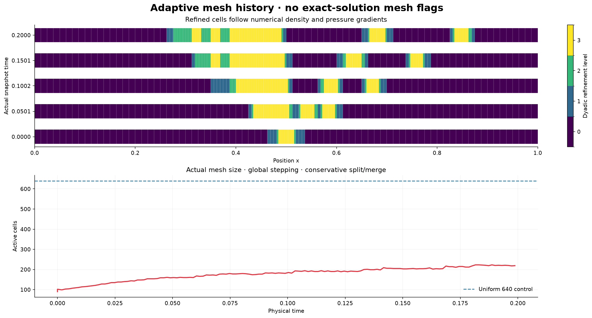
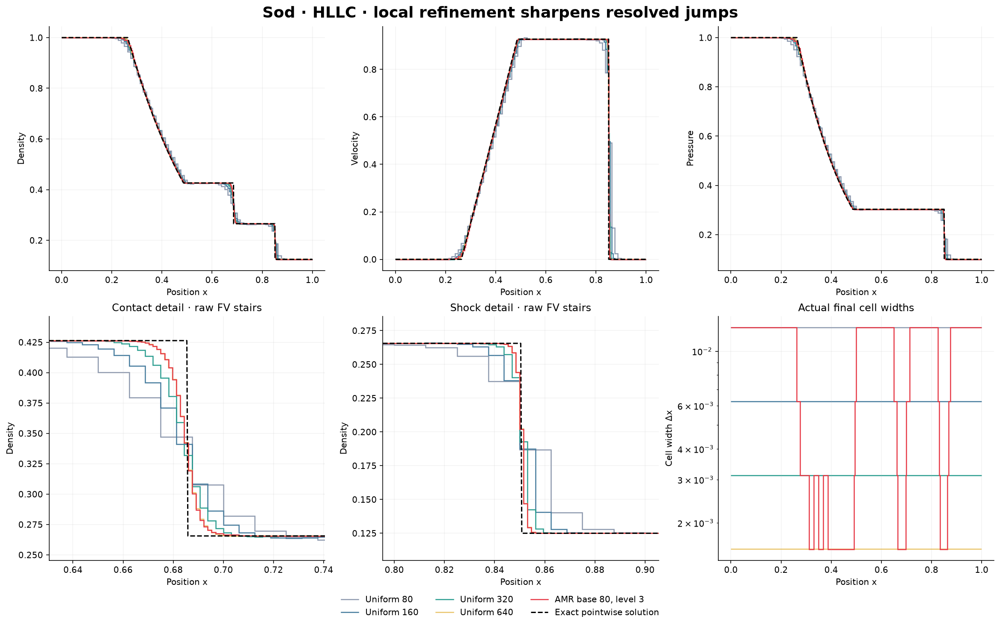
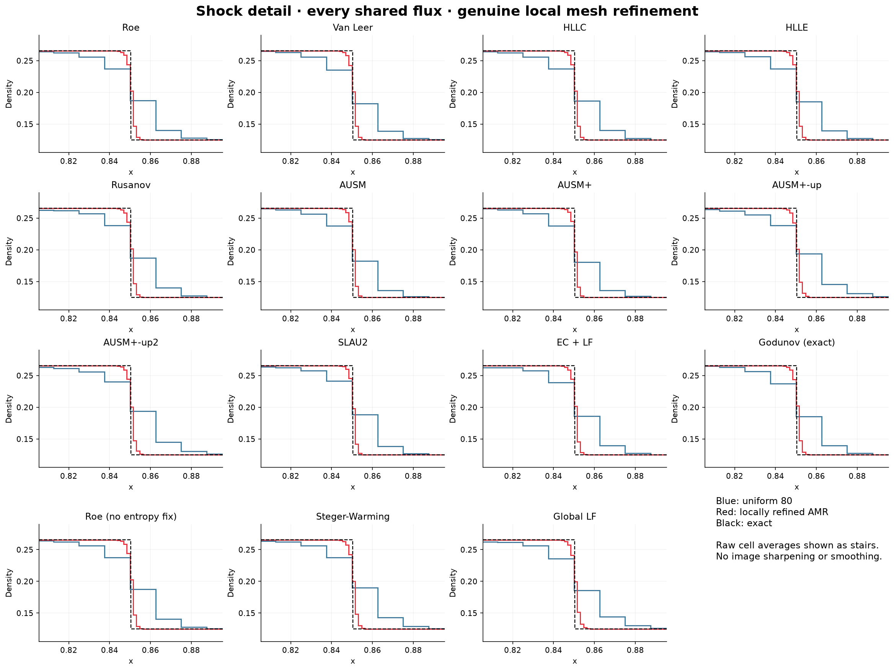
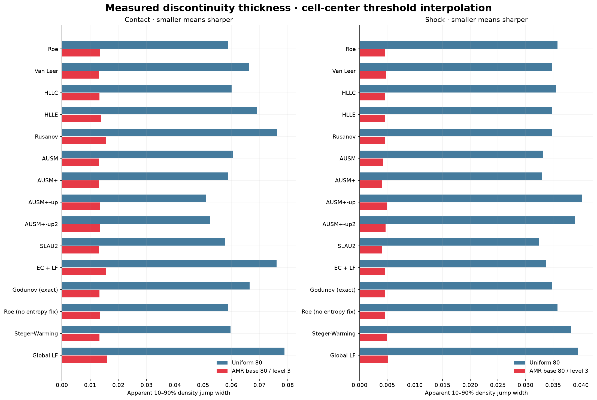
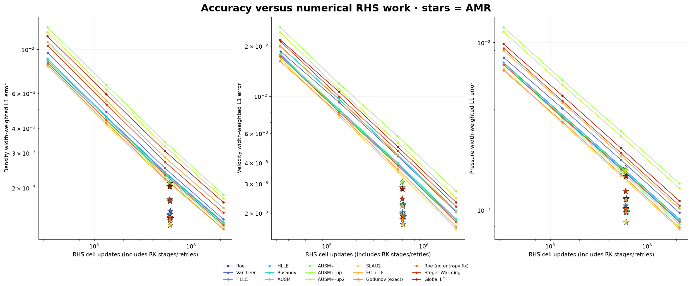

# Conservative local refinement of shock-tube discontinuities

**75 Sod runs executed; all 75 passed final-time, positivity and boundary-budget conservation checks.**
Every shared pointwise flux uses one geometry-aware CWENO3 operator on uniform 80/160/320/640 grids and on a dynamically refined mesh with base 80 and maximum level 3.

[Open the updated Colab](https://colab.research.google.com/github/Ehsan-Roohi/Ehsan-Roohi/blob/main/courses/cfd-2/modern-python/shock-tube/Shock_Tube_All_Methods_2026.ipynb) · [All mesh metrics](amr-metrics.csv) · [Raw mesh/field catalog](../conical/results-amr/catalog.json) · [Executed verification](../conical/amr-verification.json) · [Editable AMR source](../conical/shock_amr.py)

## Where the grid is refined

Both pressure and density jumps flag cells. Pressure alone can miss a contact discontinuity. The dimensionless sensor is the maximum adjacent relative jump, |q_R-q_L|/(|q_R|+|q_L|+1e-14), for density and pressure. A four-cell buffer extends each flagged region.

Refine threshold 0.02, coarsen threshold 0.004, and regrid every eight accepted steps. Cells split dyadically, exact siblings can merge, and neighboring cell widths differ by at most a factor two. The exact Riemann answer is **never used to choose the mesh**. Initial data are integrated to conservative cell means.



## Conservation and reconstruction

This is a single nonoverlapping leaf-cell partition with a global SSPRK3 step. Each coarse/fine interface has one shared numerical flux, and each residual divides by the actual cell width. There is no level subcycling, so separate coarse/fine time-flux refluxing is unnecessary. Splitting uses positivity-scaled conservative MUSCL prolongation; merging uses volume-weighted sibling means. Conservative transfer errors and the physical boundary-flux budget are independently recorded.

Nonuniform CWENO fits use integrated FV moments and actual widths. Uniform controls use this same operator, so the comparison isolates mesh resolution/adaptation. The older uniform-only implementation has slightly different nonlinear smoothness scaling; it remains in the original 592-run study. Error L1/L2 norms here are width-weighted. Exact conserved cell averages use 64-point quadrature, checked against 128 points.

The AMR interface supports first order, MUSCL/minmod and CWENO3/5 with optional characteristic reconstruction. The recorded all-flux study fixes CWENO3. Nonuniform WENO/TENO/THINC, JST and adaptive DG have **not** been implemented; their existing uniform-grid comparisons remain available. Global stepping means the finest cell controls the time step. Transfer, boundaries and limiting can reduce formal order; a smaller jump width is not proof of high-order smooth accuracy.

Algorithm context: [Clawpack's official AMR description](https://www.clawpack.org/v5.7.x/amr_algorithm.html) explains conservative adaptive-grid concerns. This project independently implements a globally stepped leaf mesh and does not call Clawpack or a packaged CFD solver.

## HLLC example: actual physical refinement

All numbers below are from the common Sod problem at t=0.2, gamma=1.4, CFL=0.25. Raw cell averages are shown as stairs; there is no plot smoothing or image sharpening.



| Mesh | Final cells | Mean active cells | Density L1 | Contact 10–90% width | Shock 10–90% width | RHS cell updates |
|---|---:|---:|---:|---:|---:|---:|
| Uniform 80 | 80 | 80.00 | 0.008820733 | 0.06011386 | 0.03555683 | 32880 |
| Uniform 160 | 160 | 160.00 | 0.004535176 | 0.03709056 | 0.0177096 | 133440 |
| Uniform 320 | 320 | 320.00 | 0.00239214 | 0.02253026 | 0.009067918 | 536640 |
| Uniform 640 | 640 | 640.00 | 0.001330756 | 0.0135142 | 0.004623922 | 2150400 |
| AMR base 80, level 3 | 219 | 178.49 | 0.001462956 | 0.01333341 | 0.004624064 | 599712 |

Relative to uniform 80, HLLC AMR lowers density L1 error by 83.41%, contact width by a factor 4.51, and shock width by a factor 7.69. The finest AMR width is 1/640; final active cells are 219, peak 223, and mean 178.49. Its density error is 9.93% larger than uniform 640, with 3.59 times fewer RHS cell updates.

RHS work counts include RK stages and rejected attempts. They exclude mesh construction/remapping and are not a total runtime speedup claim. Wall-clock times are stored but were measured with four local CPU workers. The 10–90% apparent thickness interpolates crossings of cell-center density means near each exact wave location; exact Euler jumps have zero physical thickness. This metric measures numerical smearing and depends on the method and grid.

## Every shared flux







| Flux | Uniform 80 density L1 | AMR density L1 | Reduction | Mean AMR cells | Conservation defect |
|---|---:|---:|---:|---:|---:|
| ausm | 0.008913372 | 0.001403164 | 84.26% | 182.16 | 1.22e-15 |
| ausm-plus | 0.008627992 | 0.001404019 | 83.73% | 182.49 | 2.17e-15 |
| ausm-up | 0.01294351 | 0.00210518 | 83.74% | 178.05 | 1.88e-15 |
| ausm-up2 | 0.01223408 | 0.002032776 | 83.38% | 177.93 | 3.08e-15 |
| ec-lf | 0.01090614 | 0.001723323 | 84.20% | 179.25 | 9.36e-16 |
| global-lf | 0.01166502 | 0.002029996 | 82.60% | 179.69 | 9.18e-16 |
| godunov | 0.008378518 | 0.001374956 | 83.59% | 178.68 | 8.48e-16 |
| hllc | 0.008820733 | 0.001462956 | 83.41% | 178.49 | 1.23e-15 |
| hlle | 0.009002296 | 0.001469406 | 83.68% | 178.94 | 1.13e-15 |
| roe | 0.008533055 | 0.001422927 | 83.32% | 178.99 | 3.80e-16 |
| roe-nc | 0.008536489 | 0.001423043 | 83.33% | 179.00 | 1.04e-15 |
| rusanov | 0.0109235 | 0.001721109 | 84.24% | 179.35 | 9.14e-16 |
| slau2 | 0.008213335 | 0.001302729 | 84.14% | 180.75 | 1.46e-15 |
| steger-warming | 0.01044366 | 0.001744387 | 83.30% | 177.98 | 7.73e-16 |
| vanleer | 0.009626619 | 0.001527743 | 84.13% | 181.19 | 1.59e-15 |

## Reproduce

```bash
cd ../conical
python verify_amr.py
python shock_amr.py --flux hllc --base-cells 80 --max-level 3
python shock_amr.py --flux hllc --base-cells 640 --max-level 0
python amr_study.py
```

The saved study scripts reuse existing matching output names. The CLI and Colab fresh-AMR form run new simulations; use a new output directory or remove only the intended cached study files if changing algorithm parameters.
