# Executed shock-tube comparisons

## Fixed uniform-grid refinement

[Six-grid report and plots](UNIFORM_GRID_RESULTS.md) compare all 15 shared fluxes and standalone JST on **80, 160, 320, 640, 1280 and 2560 fixed uniform cells**. The 96 grid/method comparisons show continuous cell-center curves, shock/contact details, physical properties, L1 errors and measured transition widths. The original 592-run study remains available below.

**592 runs executed; 589 reached the requested physical time and passed the recorded conservation/positivity checks.**
The complete 15-flux × 20-reconstruction Sod matrix contains 300 completed runs. These are algorithm combinations, not 300 independent physical models.

[Open the separate Colab notebook](https://colab.research.google.com/github/Ehsan-Roohi/Ehsan-Roohi/blob/main/courses/cfd-2/modern-python/shock-tube/Shock_Tube_All_Methods_2026.ipynb) · [All run metrics](run-metrics.csv) · [Raw configuration/field catalog](../conical/results-shocktube/catalog.json) · [Algorithm/source audit](../conical/ADDITIONAL_METHODS.md)

## Common Sod comparison

Domain [0,1], discontinuity x=0.5, gamma=1.4, left (rho,u,p)=(1,0,1), right (0.125,0,0.1), final time 0.2.
Common CWENO3, 80 cells, SSPRK3 and CFL 0.25; standalone JST is explicitly separated in metadata.
The shared all-speed flux call uses Mach reference/cutoff 0.1; these settings are held fixed rather than tuned per case. This parameter can affect AUSM+-up family dissipation and error rankings.
The exact solver integrates conserved states to cell averages before comparing with numerical cell means.
Reference quadrature is compared at 64 and 128 points per cell; the change is retained in every record.

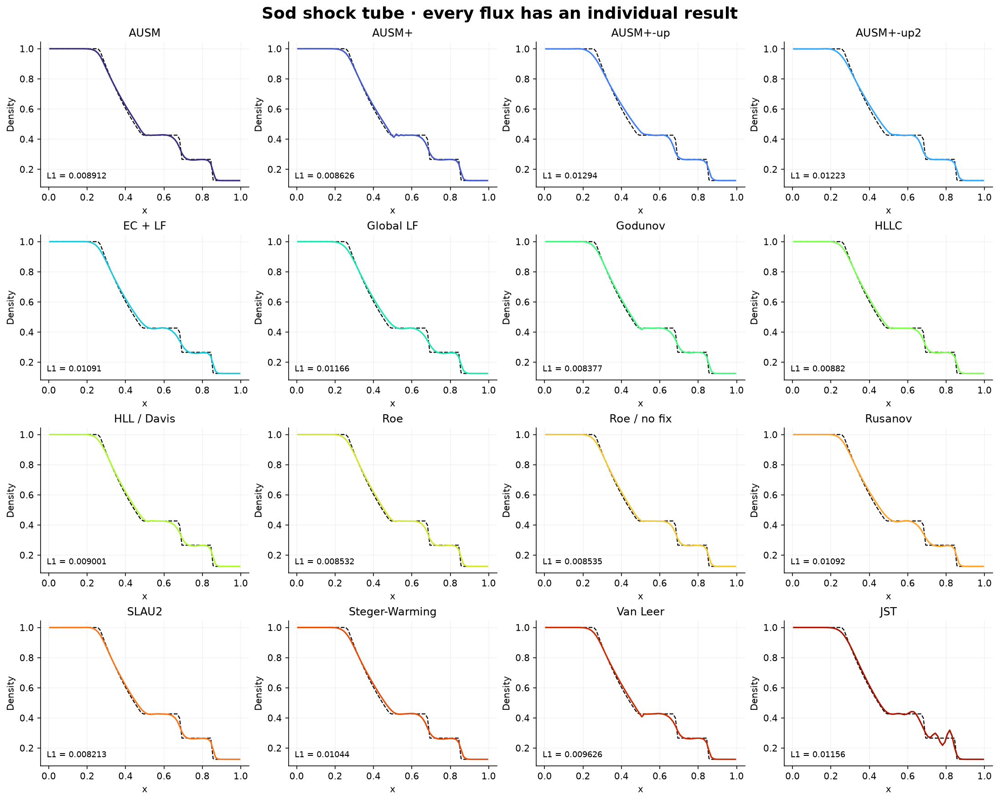

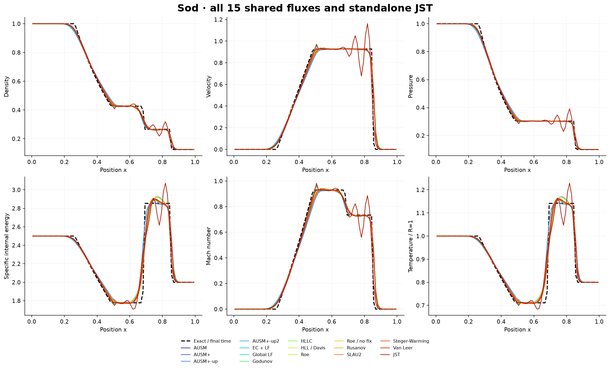

| Flux | Reconstruction | Cells | Time | Status | Density L1 | Velocity L1 | Pressure L1 |
|---|---|---|---|---|---|---|---|
| ausm | cweno3 | 80 | 0.2 | Completed | 0.00891229 | 0.0174658 | 0.00745623 |
| ausm-plus | cweno3 | 80 | 0.2 | Completed | 0.00862644 | 0.0179889 | 0.00734471 |
| ausm-up | cweno3 | 80 | 0.2 | Completed | 0.0129417 | 0.0258996 | 0.0123423 |
| ausm-up2 | cweno3 | 80 | 0.2 | Completed | 0.0122327 | 0.0241742 | 0.0116152 |
| ec-lf | cweno3 | 80 | 0.2 | Completed | 0.0109062 | 0.0198396 | 0.00897148 |
| global-lf | cweno3 | 80 | 0.2 | Completed | 0.0116648 | 0.021813 | 0.00980824 |
| godunov | cweno3 | 80 | 0.2 | Completed | 0.00837673 | 0.0162264 | 0.00683373 |
| hllc | cweno3 | 80 | 0.2 | Completed | 0.00881958 | 0.0178406 | 0.00760153 |
| hlle | cweno3 | 80 | 0.2 | Completed | 0.00900091 | 0.0173336 | 0.00738514 |
| jst | first | 80 | 0.2 | Completed | 0.0115606 | 0.030064 | 0.0124093 |
| roe | cweno3 | 80 | 0.2 | Completed | 0.0085319 | 0.0173555 | 0.00735997 |
| roe-nc | cweno3 | 80 | 0.2 | Completed | 0.00853532 | 0.0173632 | 0.00736309 |
| rusanov | cweno3 | 80 | 0.2 | Completed | 0.0109236 | 0.0200711 | 0.0089882 |
| slau2 | cweno3 | 80 | 0.2 | Completed | 0.00821342 | 0.0168116 | 0.00696697 |
| steger-warming | cweno3 | 80 | 0.2 | Completed | 0.0104443 | 0.0212877 | 0.00924816 |
| vanleer | cweno3 | 80 | 0.2 | Completed | 0.00962587 | 0.0186046 | 0.00813959 |

## Complete combination matrix

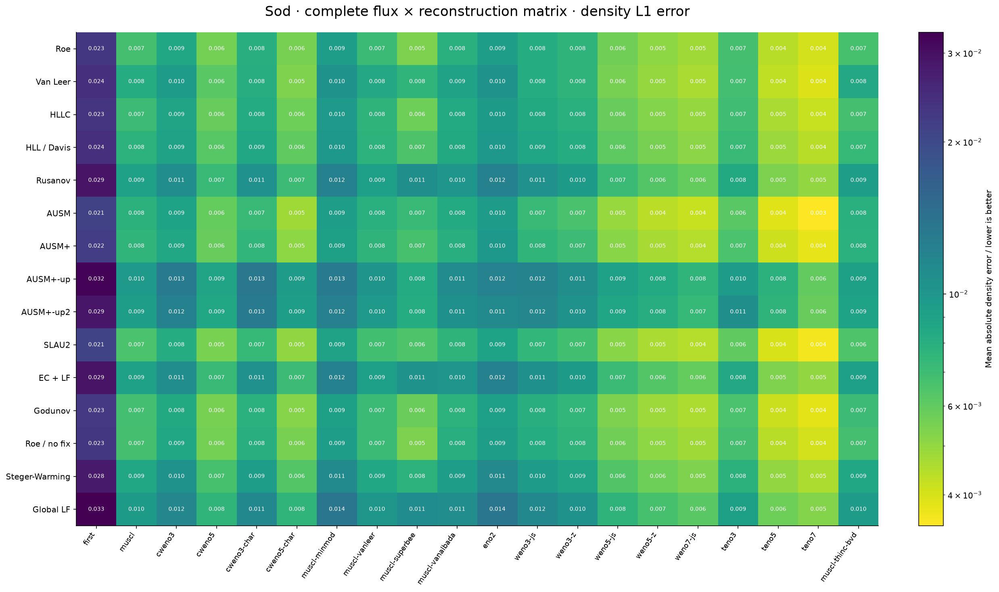

The smallest error is specific to this case, grid, metric and reconstruction. It does not establish a universally best method. The exact Godunov face flux still has spatial and temporal discretization errors.

## Reconstruction comparison

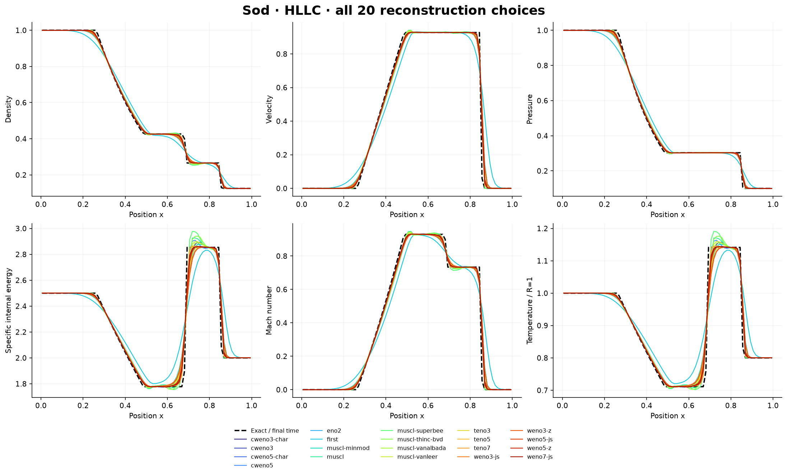

| Flux | Reconstruction | Cells | Time | Status | Density L1 | Velocity L1 | Pressure L1 |
|---|---|---|---|---|---|---|---|
| hllc | cweno3-char | 80 | 0.2 | Completed | 0.00828609 | 0.0161809 | 0.00666619 |
| hllc | cweno3 | 80 | 0.2 | Completed | 0.00881958 | 0.0178406 | 0.00760153 |
| hllc | cweno5-char | 80 | 0.2 | Completed | 0.00571907 | 0.0114348 | 0.00463021 |
| hllc | cweno5 | 80 | 0.2 | Completed | 0.00586352 | 0.012463 | 0.0050499 |
| hllc | eno2 | 80 | 0.2 | Completed | 0.00970159 | 0.0189336 | 0.00833902 |
| hllc | first | 80 | 0.2 | Completed | 0.0233863 | 0.0481371 | 0.022083 |
| hllc | muscl-minmod | 80 | 0.2 | Completed | 0.00971622 | 0.018967 | 0.0082989 |
| hllc | muscl | 80 | 0.2 | Completed | 0.00702289 | 0.013544 | 0.00602004 |
| hllc | muscl-superbee | 80 | 0.2 | Completed | 0.00572294 | 0.011214 | 0.0047788 |
| hllc | muscl-thinc-bvd | 80 | 0.2 | Completed | 0.0067275 | 0.0113584 | 0.0052725 |
| hllc | muscl-vanalbada | 80 | 0.2 | Completed | 0.00831098 | 0.016553 | 0.00717501 |
| hllc | muscl-vanleer | 80 | 0.2 | Completed | 0.00762627 | 0.0144542 | 0.00647352 |
| hllc | teno3 | 80 | 0.2 | Completed | 0.0069253 | 0.0142116 | 0.005759 |
| hllc | teno5 | 80 | 0.2 | Completed | 0.00462522 | 0.00937277 | 0.00384618 |
| hllc | teno7 | 80 | 0.2 | Completed | 0.00419074 | 0.00876706 | 0.00359223 |
| hllc | weno3-js | 80 | 0.2 | Completed | 0.00841425 | 0.016393 | 0.00678336 |
| hllc | weno3-z | 80 | 0.2 | Completed | 0.0078685 | 0.0154005 | 0.00632054 |
| hllc | weno5-js | 80 | 0.2 | Completed | 0.00585454 | 0.0114756 | 0.00474718 |
| hllc | weno5-z | 80 | 0.2 | Completed | 0.00527996 | 0.0107219 | 0.00433341 |
| hllc | weno7-js | 80 | 0.2 | Completed | 0.00496954 | 0.009998 | 0.00412593 |

## Mesh-error convergence

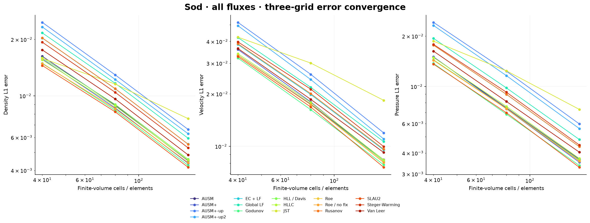

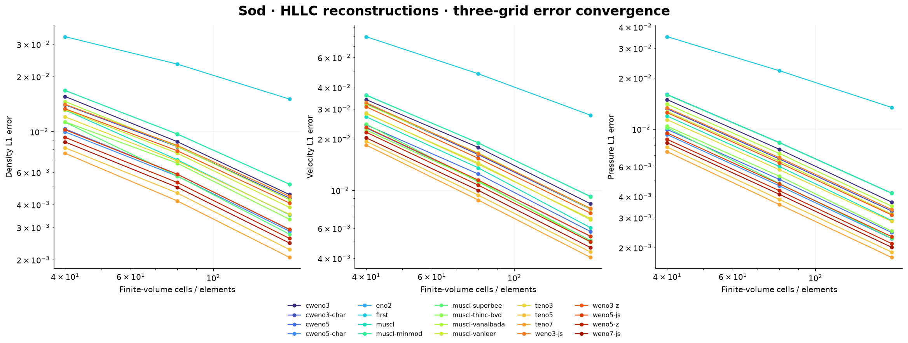

All DG degree/flux pairs also use three grids:

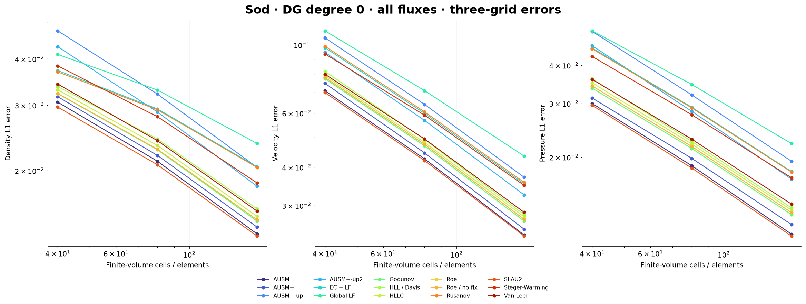

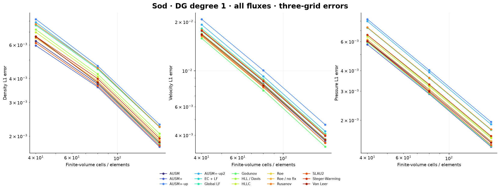

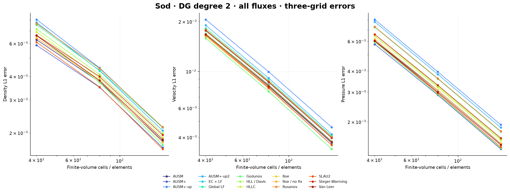

Global shock/contact errors do not follow formal smooth orders. The characteristic TVB limiter can suppress higher modal coefficients near waves; degree alone is not an accuracy ranking.

## Physical diagnostics

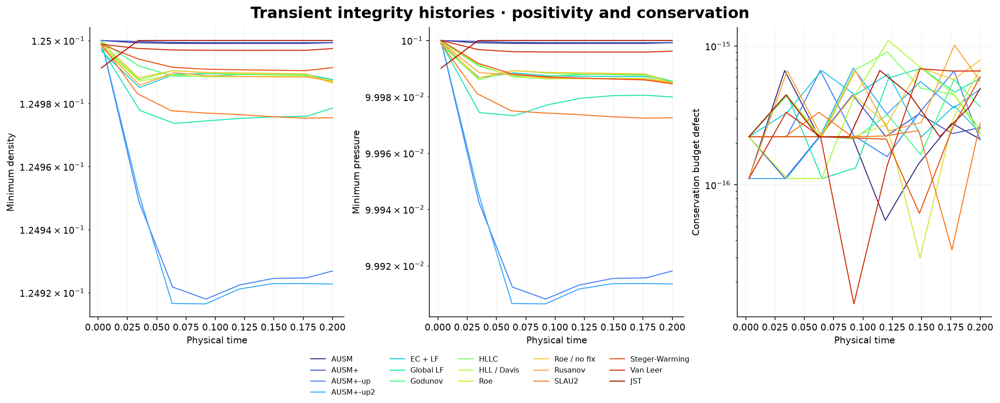

The conservation defect is the difference between the domain integral and the accumulated SSPRK-weighted boundary flux budget. A nonzero transient PDE residual is not a failure to reach a steady state; no steady-residual convergence plot is presented for shock-tube evolution.

## Additional wave tests and failures

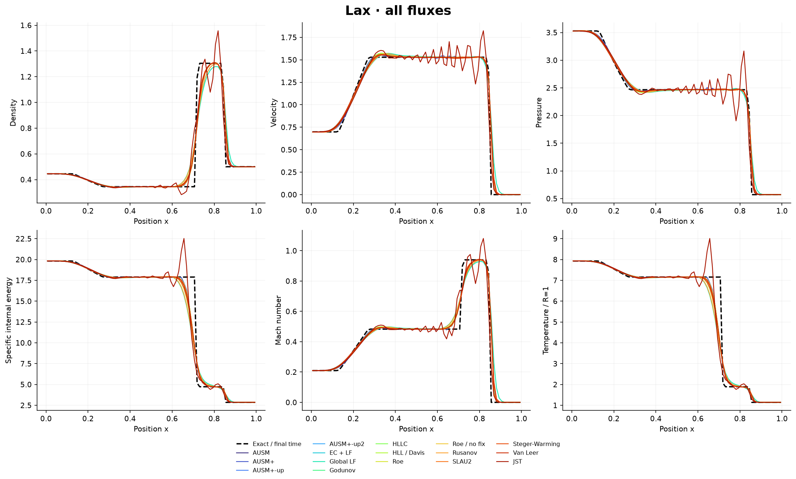

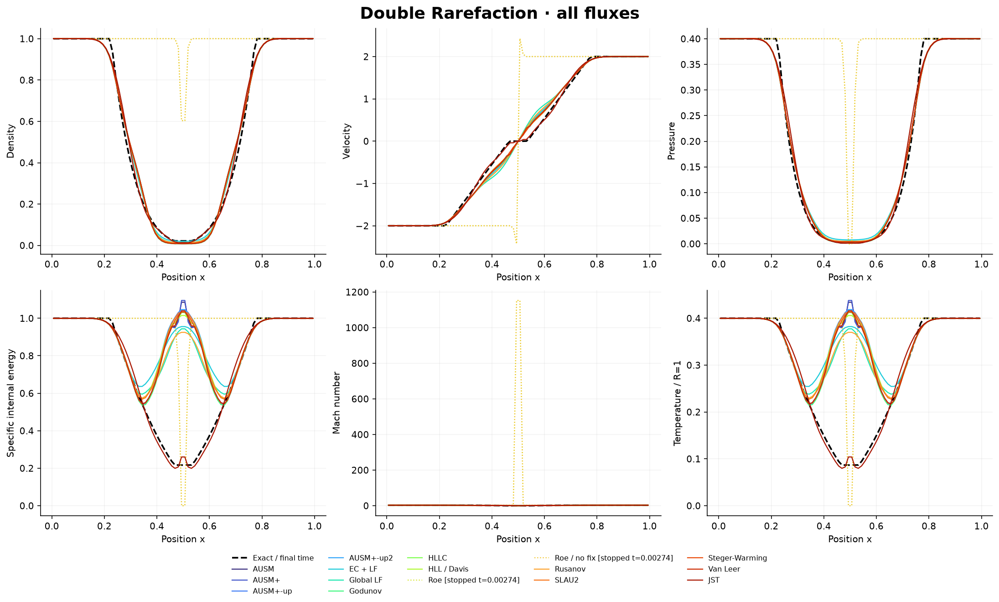

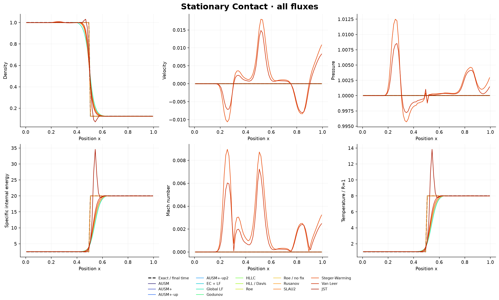

Dotted stopped curves show earlier-time diagnostic states and their actual times. They are not assigned final-time accuracy errors.

| Flux | Reconstruction | Cells | Time | Status | Density L1 | Velocity L1 | Pressure L1 |
|---|---|---|---|---|---|---|---|
| hllc | weno7-js | 80 | 0.0312902 | Positivity recovery exhausted | Not eligible | Not eligible | Not eligible |
| roe | cweno3 | 80 | 0.00274245 | Positivity recovery exhausted | Not eligible | Not eligible | Not eligible |
| roe-nc | cweno3 | 80 | 0.00274245 | Positivity recovery exhausted | Not eligible | Not eligible | Not eligible |

Roe (with and without the present entropy smoothing) and HLLC/WENO7-JS exhausted positivity recovery in the double-rarefaction test. These failures are preserved; there is no automatic relabelling of another fallback solver as success for these runs.

## Verification and reproduction

[Component tests and measured smooth FV orders](../conical/additional-verification.json) cross-check the Godunov sampler with the independent earlier Sod reference, check a true vacuum sample and all shared equal-state fluxes. [Notebook execution evidence](colab-validation.json) records actual default-cell execution on a local CPU. The public runtime ZIP's SHA is checked during notebook startup. Google-hosted execution is not claimed.

This is a transient ideal-gas Euler benchmark. It does not validate cone geometry, physical viscosity, turbulence, real-gas chemistry or all possible Riemann states.
