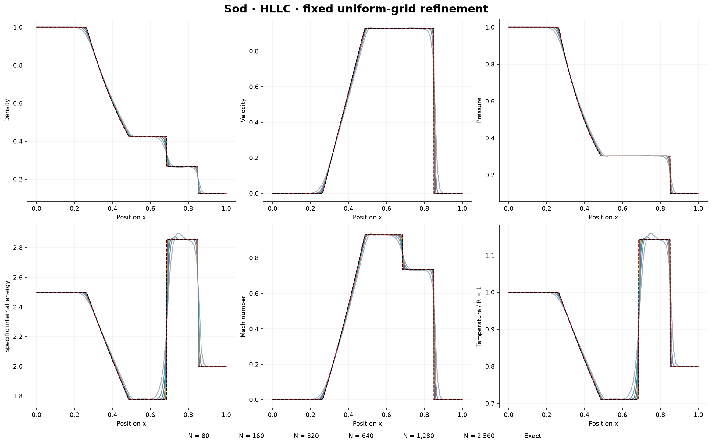
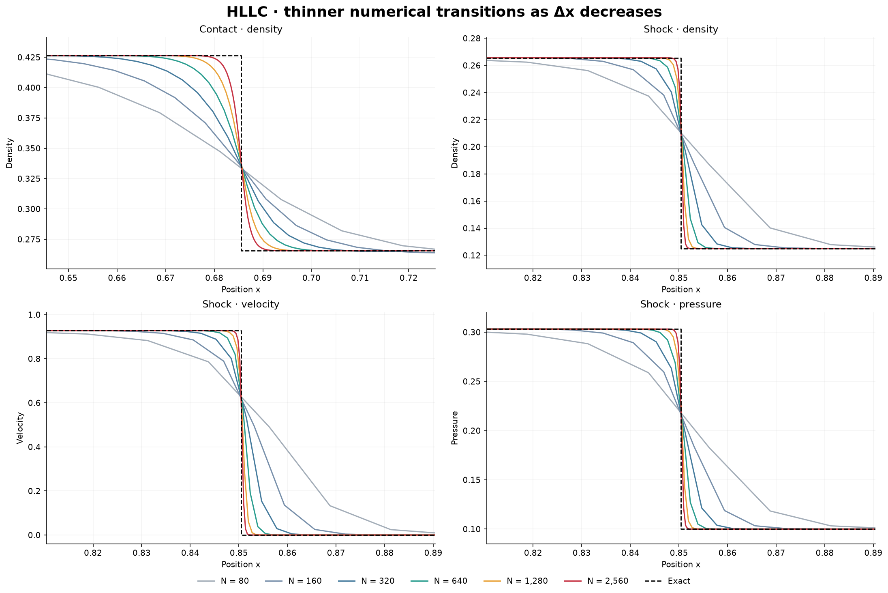
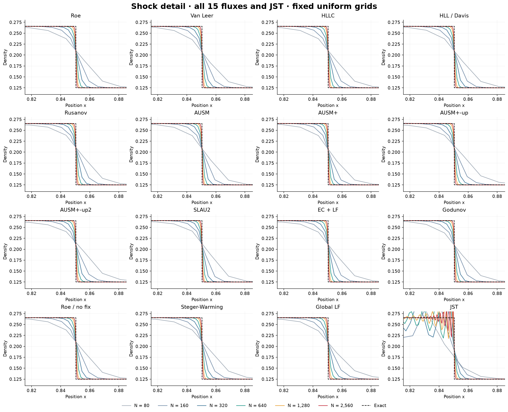
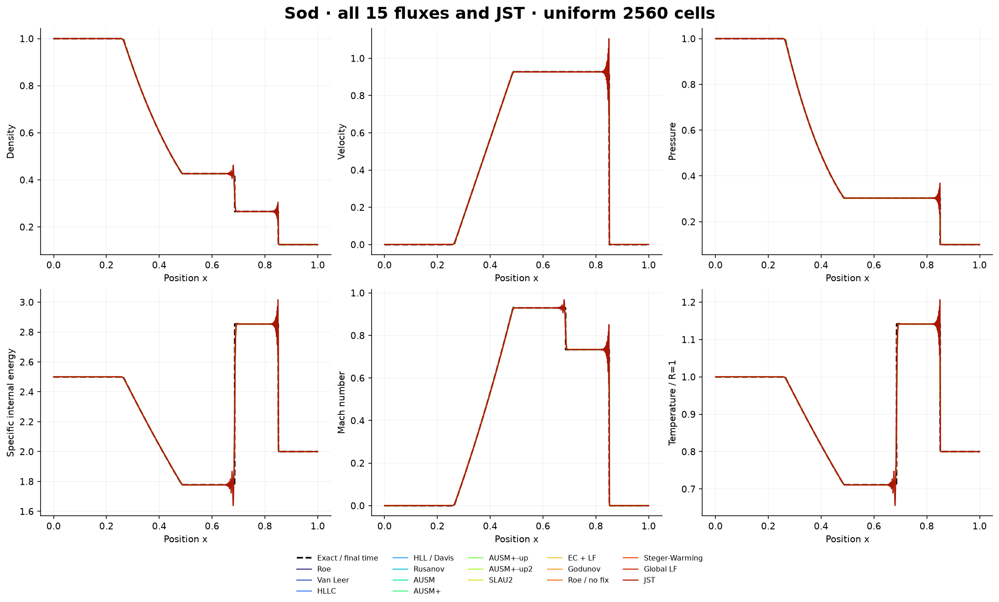
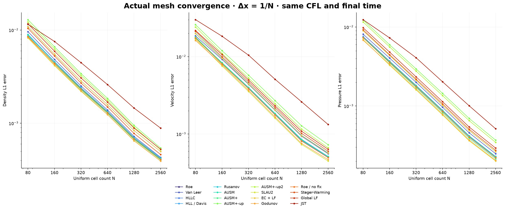
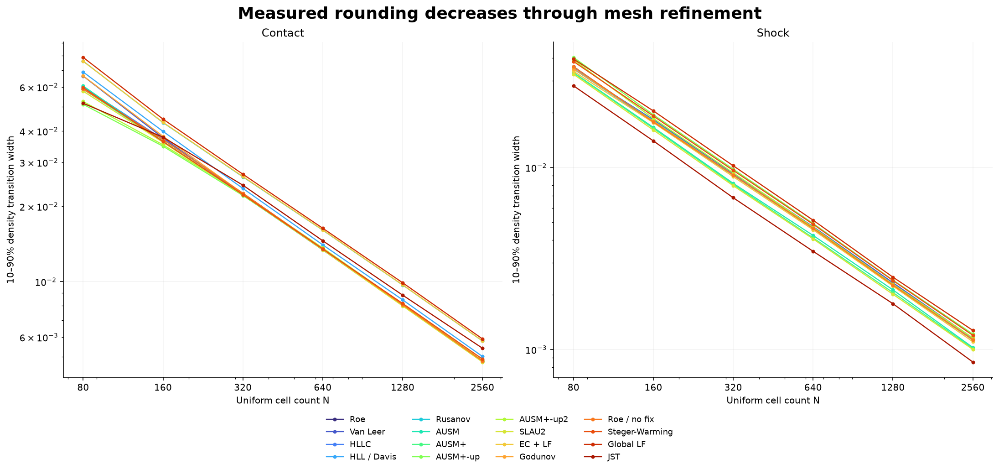

# Fixed uniform-grid refinement of the Sod shock tube

**96 grid/method comparisons passed final-time, positivity and conservation checks.**
The mesh is fixed and uniformly spaced throughout every run. N = 80, 160, 320, 640, 1280, 2560; Δx = 1/N.
The 80/160 runs reuse matching executed TubeSolver outputs from the original study; 64 additional finer-grid runs were computed for this study.

## Controlled comparison

Domain [0,1], initial interface x=0.5, gamma=1.4, left (rho,u,p)=(1,0,1), right (0.125,0,0.1), final time t=0.2.
Every grid uses the original uniform TubeSolver, fixed CFL=0.25, SSPRK3 and outflow boundaries. All 15 pointwise fluxes use CWENO3; standalone JST retains its central stencil. All-speed reference Mach settings are unchanged.
This isolates grid-size effects within each method. It is a 16-method × 6-grid study, not a six-grid repeat of all 300 flux/reconstruction combinations or the DG study.
Curves connect computed cell-center means. Error norms compare numerical conserved means, converted to primitive variables, against the same conversion of integrated exact means. No plot filter or artificial sharpening is used.
The 10–90% density transition width uses linear threshold interpolation between neighboring computed cell centers. The physical width and its ratio to Δx are both recorded.

## What refinement changes

For HLLC, density L1 falls from 0.0088195802 at N=80 to 0.00041636916 at N=2560 (95.28% reduction).
The shock density transition narrows from 0.035551804 to 0.0011293594; the contact transition from 0.060095913 to 0.0048100238.
A shock-capturing discretization still represents a jump across a finite number of cells. Refinement reduces its physical thickness; it does not guarantee a zero-width jump on a finite mesh. The rarefaction fan is physically smooth and must remain smooth.
Contact and shock widths may converge at different rates. Grid alignment, limiting and numerical diffusion affect adjacent-grid width ratios; global discontinuous-solution order is distinct from formal smooth accuracy.
Keeping CFL fixed reduces the time step along with Δx. Runtime therefore rises through both extra cells and extra steps; elapsed timings are local concurrent CPU measurements, not controlled serial speed benchmarks.

## HLLC grid sequence

| Cells | Δx | Density L1 | Shock width | Contact width | Shock width / Δx | Contact width / Δx |
|---:|---:|---:|---:|---:|---:|---:|
| 80 | 0.0125 | 0.0088195802 | 0.035551804 | 0.060095913 | 2.844 | 4.808 |
| 160 | 0.00625 | 0.0045349923 | 0.017708451 | 0.037084577 | 2.833 | 5.934 |
| 320 | 0.003125 | 0.002392073 | 0.0090678292 | 0.02252903 | 2.902 | 7.209 |
| 640 | 0.0015625 | 0.0013307353 | 0.0046239101 | 0.013514039 | 2.959 | 8.649 |
| 1280 | 0.00078125 | 0.00069409491 | 0.0022581643 | 0.0080773219 | 2.89 | 10.34 |
| 2560 | 0.000390625 | 0.00041636916 | 0.0011293594 | 0.0048100238 | 2.891 | 12.31 |

## Every method on all six grids

| Method | Density L1: 80 → 2560 | Shock width: 80 → 2560 | Contact width: 80 → 2560 |
|---|---:|---:|---:|
| Roe | 0.0085319 → 0.000409722 | 0.0357964 → 0.00113266 | 0.0588321 → 0.00481791 |
| Van Leer | 0.00962587 → 0.000430895 | 0.0347558 → 0.00115513 | 0.0663884 → 0.00480531 |
| HLLC | 0.00881958 → 0.000416369 | 0.0355518 → 0.00112936 | 0.0600959 → 0.00481002 |
| HLL / Davis | 0.00900091 → 0.000423645 | 0.0347518 → 0.00113258 | 0.0689049 → 0.00502174 |
| Rusanov | 0.0109236 → 0.00049842 | 0.0347912 → 0.00113258 | 0.0761694 → 0.00579275 |
| AUSM | 0.00891229 → 0.000416625 | 0.0331756 → 0.00102645 | 0.0605863 → 0.00482276 |
| AUSM+ | 0.00862644 → 0.000404095 | 0.0330405 → 0.00101295 | 0.0587902 → 0.0047918 |
| AUSM+-up | 0.0129417 → 0.00054256 | 0.0402323 → 0.00121641 | 0.0511608 → 0.00481609 |
| AUSM+-up2 | 0.0122327 → 0.000522069 | 0.0389818 → 0.00115924 | 0.0525224 → 0.00482756 |
| SLAU2 | 0.00821342 → 0.000392917 | 0.0324849 → 0.00100153 | 0.0577388 → 0.00477148 |
| EC + LF | 0.0109062 → 0.000498748 | 0.0337521 → 0.0011045 | 0.076061 → 0.00579536 |
| Godunov | 0.00837673 → 0.000393382 | 0.0348401 → 0.00113328 | 0.0664981 → 0.00480962 |
| Roe / no fix | 0.00853532 → 0.000409726 | 0.0357966 → 0.00113266 | 0.0588401 → 0.0048179 |
| Steger-Warming | 0.0104443 → 0.0004625 | 0.0381981 → 0.00119725 | 0.0596818 → 0.00490179 |
| Global LF | 0.0116648 → 0.000526495 | 0.0394088 → 0.00127427 | 0.0788404 → 0.00590326 |
| JST | 0.0115606 → 0.000887943 | 0.0280852 → 0.000853852 | 0.0516696 → 0.00541766 |

## Integrity and reproducibility

Maximum conservation-budget defect across the 96 runs: 5.10703e-15. Every run reaches t=0.2 with finite positive density and pressure.
[All grid metrics](uniform-grid-metrics.csv) · [Hashed raw-field catalog](../conical/results-uniform/catalog.json) · [Study driver](../conical/uniform_refinement.py) · [Numerical solver](../conical/shock_suite.py) · [Plot source](../conical/uniform_dashboard.py).
[Open the executed Colab notebook](https://colab.research.google.com/github/Ehsan-Roohi/Ehsan-Roohi/blob/main/courses/cfd-2/modern-python/shock-tube/Shock_Tube_All_Methods_2026.ipynb).
The main notebook and downloadable shock-tube package use fixed uniform grids. Previous adaptive-study files are retained as historical artifacts, outside this notebook and its runtime package.
