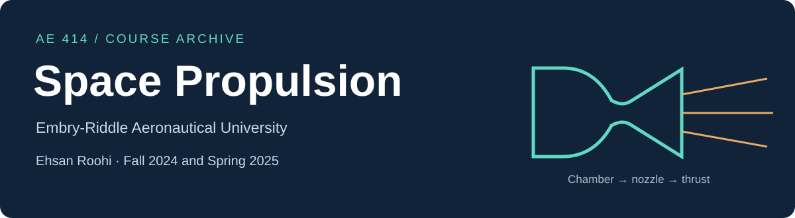

# AE 414 Space Propulsion

**Embry-Riddle Aeronautical University · Daytona Beach**  
**Fall 2024 and Spring 2025 · Dr. Ehsan Roohi Golkhatmi**

An organized archive of the lectures, annotated classroom notes, explanatory recordings and exercises used to teach space propulsion over two semesters. Follow the course from rocket performance and staging through chemical rocket systems, nozzle design and electric propulsion.

**[Syllabus](SYLLABUS.md)** · **[Fall 2024 archive](semesters/fall-2024/README.md)** · **[Spring 2025 archive](semesters/spring-2025/README.md)** · **[Lecture index](LECTURES.md)** · **[Videos](VIDEOS.md)** · **[Homework and exercises](ASSIGNMENTS.md)** · **[Materials and tools](MATERIALS.md)**

## Follow the course

Each module has its own page connecting lectures, recordings, exercises and supporting materials. The sequence follows the Fall 2024 syllabus and original lecture outline. Spring 2025 files retain their own part and homework numbers.

| Module | Topic | Fall 2024 teaching weeks | Open |
| --- | --- | --- | --- |
| 01 | Rocket performance and staging | 1–2 | [Lectures and learning guide](modules/01-rocket-performance/README.md) |
| 02 | Thermodynamics and compressible flow | 3 | [Lectures and learning guide](modules/02-thermodynamics-and-nozzle-flow/README.md) |
| 03 | Chemical rocket thrust chambers | 4–5 | [Lectures and learning guide](modules/03-thrust-chambers/README.md) |
| 04 | Combustion chemistry and NASA CEA | 6 | [Lectures and learning guide](modules/04-combustion-and-cea/README.md) |
| 05 | Liquid rocket engines | 6–8 | [Lectures and learning guide](modules/05-liquid-rockets/README.md) |
| 06 | Solid rocket motors | 8–9 | [Lectures and learning guide](modules/06-solid-rockets/README.md) |
| 07 | Nozzle design and the method of characteristics | 10–11 | [Lectures and learning guide](modules/07-nozzle-design/README.md) |
| 08 | Hybrid rocket engines | 11–13 | [Lectures and learning guide](modules/08-hybrid-rockets/README.md) |
| 09 | Electric propulsion | 13–15 | [Lectures and learning guide](modules/09-electric-propulsion/README.md) |
| 10 | Nuclear thermal propulsion | Supplement | [Lectures and learning guide](modules/10-nuclear-propulsion/README.md) |

## Choose a semester

| Offering | Lecture PDFs | Exercise material | Syllabus |
| --- | ---: | --- | --- |
| [Fall 2024](semesters/fall-2024/README.md) | 31 | 14 numbered exercise-bank sheets and one team design brief | [Original PDF](syllabi/AE414_Fall_2024_Syllabus.pdf) · [Word](syllabi/AE414_Fall_2024_Syllabus.docx) |
| [Spring 2025](semesters/spring-2025/README.md) | 32 | 11 numbered homework sheets | Semester-specific syllabus not yet available in this archive |

The Fall 2024 folder contains an exercise bank whose numbering differs from the weekly assignment schedule. These sheets are indexed by their original numbers; their presence does not establish that every sheet was assigned. The Spring 2025 syllabus and recordings have not been located. Fall 2024 recordings can be used as labeled companions to matching Spring 2025 topics.

The video archive contains **17 complete recordings**, including a classroom lecture with student image areas obscured. Three recordings have two consecutive download segments.

## Search and play the archive

The [course browser](index.html) lets you search resources, filter by semester and file type, and play the recordings beside their lecture notes. Download or clone the repository, keep the course folders together, and open `index.html` in a browser. On GitHub, use the module pages and the PDF/MP4 download links above.

## Work through a module

1. Open the annotated lecture notes in the order shown on the module page.
2. Watch the corresponding explanation or weekly recap.
3. Attempt the linked exercise and record assumptions, units and model limits.
4. Compare a numerical answer with a hand calculation or a limiting case. For a CEA calculation, retain the inputs and complete output.

These are preserved historical teaching materials. Dates, grading rules and contact details in the original syllabus belong to that offering. [Current instructor contact](mailto:roohie@umass.edu).

## Related courses

[Aerospace Structures](https://github.com/Ehsan-Roohi/Aerospace-Structures) · [FlowMLLab](https://github.com/Ehsan-Roohi/FlowMLLab) · [Introduction to Compressible Flows](https://github.com/Ehsan-Roohi/Introduction-to-Compressible-Flows)

[Source provenance and reuse](PROVENANCE.md) · [Citation](CITATION.cff) · [Full asset manifest](manifest.json)
